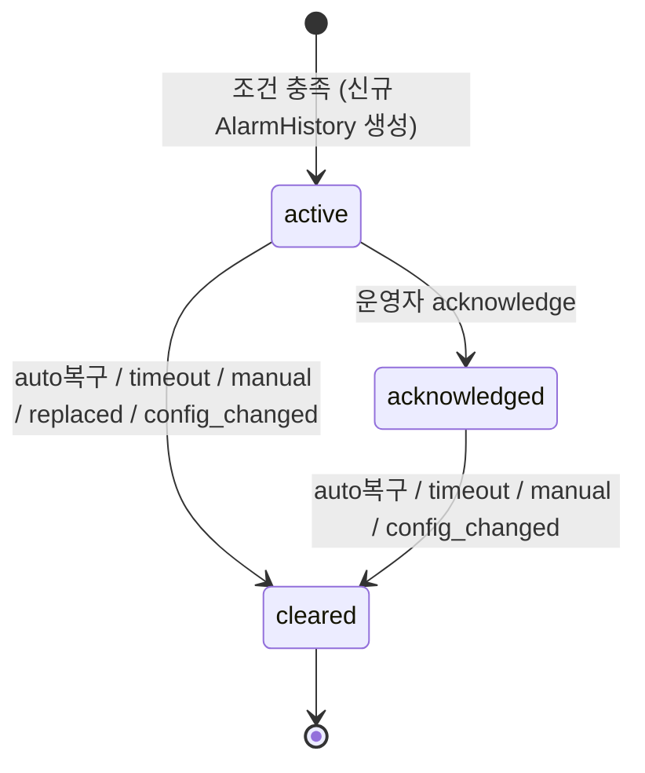
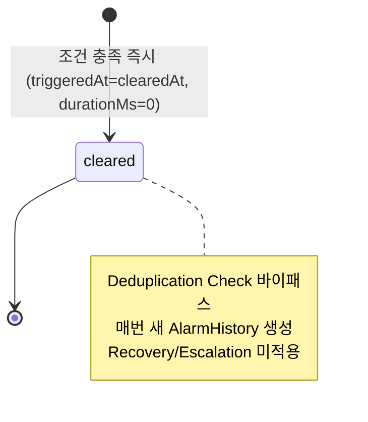
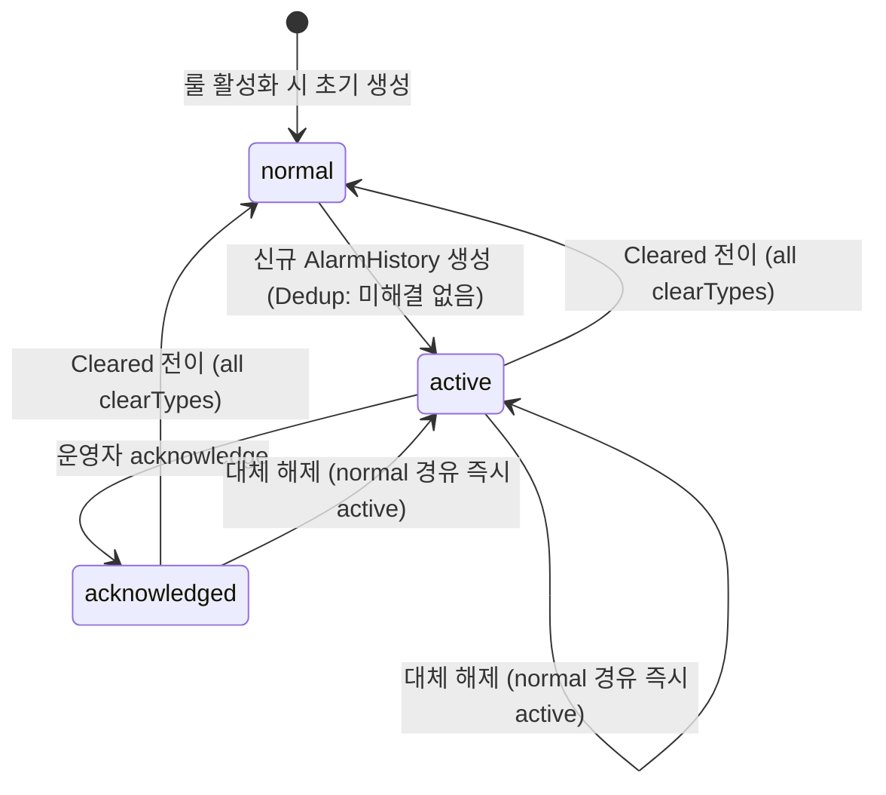
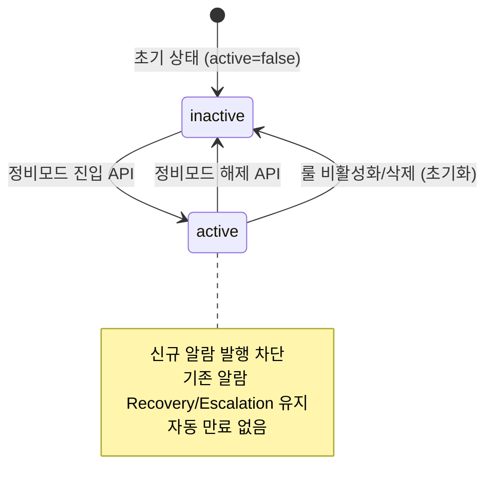
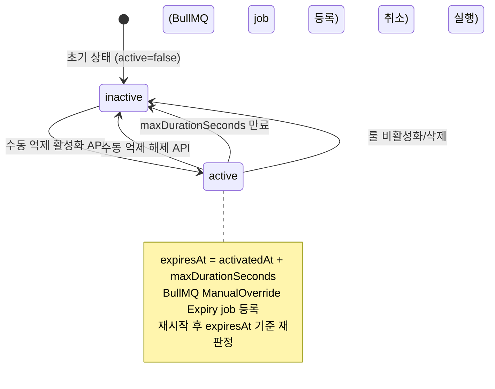
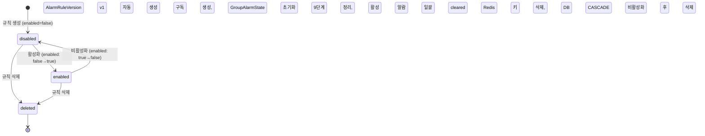

# 도메인 모델 검증 — 가독성 개선 버전

---

## Executive Summary

이 문서는 알람 시스템의 도메인 모델이 올바르게 설계되었는지 검증하기 위한 종합 명세서다. 크게 네 파트로 구성된다.

**Part 1 (전이 테이블)** 은 핵심 도메인 객체 6종(AlarmHistory state 타입, AlarmHistory event 타입, GroupAlarmState, SuppressionRuntimeState, StreamControl 런타임, AlarmRule 라이프사이클)이 각 이벤트에 어떻게 반응하는지를 표 형태로 정의한다. 이벤트는 메시지 수신, 시간 기반, 런타임 제어, 억제, 규칙 관리, 시스템 이벤트의 6개 그룹으로 분류된다.

**Part 2 (시나리오 목록)** 는 규칙 관리(M), 알람 런타임(R), 연관 객체(H), 교차 조건(X), 정책 충돌/경계(C) 5개 범주의 총 88개 검증 시나리오를 정의한다. 각 시나리오는 구체적인 검증 포인트를 제시하여 구현 테스트의 기준이 된다.

**Part 3 (End-to-End 라이프사이클 시나리오)** 는 복잡도별(단순/중간/복잡/고급) 11개의 전체 흐름 시나리오로, 실제 운영 환경에서의 도메인 객체 상호작용을 시간축으로 추적한다.

**Part 4 (미정의 분기 목록)** 는 구현 시 모호성이 있는 10개 항목을 명시한다. 이 중 U02(recoveryThreshold 의미 이중성)와 U06(복합 조건 히스테리시스 반전 기준)이 가장 중요하다.

---

## 목차

1. [Part 1: 전이 테이블](#part-1-전이-테이블)
   - [1. AlarmHistory — state 타입](#1-alarmhistory--state-타입)
   - [2. AlarmHistory — event 타입](#2-alarmhistory--event-타입)
   - [3. GroupAlarmState](#3-groupalarmstate)
   - [4. SuppressionRuntimeState](#4-suppressionruntimestate)
   - [5. StreamControl 런타임](#5-streamcontrol-런타임)
   - [6. AlarmRule 라이프사이클](#6-alarmrule-라이프사이클)
2. [Part 2: 시나리오 목록](#part-2-시나리오-목록)
   - [M — 규칙 관리](#m--규칙-관리-crud-단독)
   - [R — 알람 런타임](#r--알람-런타임)
   - [H — 연관 객체](#h--연관-객체-이력버전참조-무결성)
   - [X — 교차 조건](#x--교차-규칙-변경--런타임-상태)
   - [C — 정책 충돌/경계](#c--정책-충돌경계-조건)
3. [Part 3: End-to-End 라이프사이클 시나리오](#part-3-end-to-end-라이프사이클-시나리오)
   - [ES — 단순 시나리오](#es-e-단순-5~6-구간)
   - [EM — 중간 시나리오](#em-e-중간-6~8-구간)
   - [EC — 복잡 시나리오](#ec-e-복잡-8~10-구간)
   - [EA — 고급 시나리오](#ea-e-고급-10-구간)
4. [Part 4: 미정의 분기 목록](#part-4-미정의-분기-목록)

---

## Quick Reference — 핵심 상태 전이 한눈에 보기

### AlarmHistory (state 타입) 핵심 전이

| 전이 | 트리거 | clearType | recoveryActions 실행 여부 |
|------|--------|-----------|--------------------------|
| active → cleared | auto 복구 조건 충족 | `auto` | 실행 |
| active → cleared | Recovery timeout 만료 | `timeout` | 실행 |
| active → cleared | 운영자 수동 해제 | `manual` | 미실행 |
| active → cleared | ratedLevel 변경(대체 해제) | `replaced` | 미실행 |
| active → cleared | 룰 비활성화/삭제/DataSource 변경 | `config_changed` | 미실행 |
| active → acknowledged | 운영자 확인 | — | 미실행 |
| acknowledged → cleared | 모든 Cleared 경로 동일 적용 | (위와 동일) | (위와 동일) |

### GroupAlarmState 핵심 전이

| 전이 | 조건 |
|------|------|
| normal → active | 신규 AlarmHistory 생성 |
| active → acknowledged | 운영자 acknowledge |
| active/acknowledged → normal | Cleared 전이 (모든 clearType) |

### Suppression Check 4단계 순서

1단계 maintenanceMode → 2단계 parentRuleId → 3단계 schedule → 4단계 manualOverride  
(앞 단계에서 억제 결정 시 이후 단계 평가 생략)  
단, schedule(3단계)에만 `exemptSeverities` 면제가 적용됨

---

---

# Part 1: 전이 테이블

---

## 1. AlarmHistory — state 타입

> 알람이 발생해서 해제되기까지의 상태를 추적하는 핵심 엔티티.
> active(활성) -> acknowledged(확인됨) -> cleared(해제됨) 의 3단계 상태를 가진다.

### 상태 정의

| 상태 | 설명 |
|------|------|
| `active` | 알람 활성. 조건 충족 시 AlarmHistory 생성, GroupAlarmState.status = "active" |
| `acknowledged` | 운영자 확인 완료. AlarmHistory.acknowledgedAt 기록됨 |
| `cleared` | 알람 해제. clearType에 따라 구분 |

### 상태 전이 다이어그램

---

### 그룹 A: 메시지 수신 이벤트

> 센서 데이터 등 메시지 수신 시 AlarmHistory가 어떻게 반응하는지 정의한다.

**요약 테이블**

| 이벤트 | active | acknowledged | cleared |
|--------|--------|--------------|---------|
| 조건 충족 (ratedLevel 동일) | active 유지 (중복 병합) | acknowledged 유지 (중복 병합) | 신규 active 생성 |
| 조건 충족 (ratedLevel 변경) | 대체 해제 후 신규 active | 대체 해제 후 신규 active | 신규 active 생성 |
| 조건 미충족 | active 유지 | acknowledged 유지 | cleared 유지 (해당 없음) |
| 조건 미충족 + auto 복구 조건 충족 | cleared 전이 (auto) | cleared 전이 (auto) | 해당 없음 |
| 이상 메시지 (NaN/null/고착) — 조건 충족 | active 유지 또는 대체 해제 | acknowledged 유지 또는 대체 해제 | 신규 active 생성 |
| 이상 메시지 — 조건 미충족 | active 유지 | acknowledged 유지 | cleared 유지 |
| freshness 만료 (onExpired=alarm) | active 유지 또는 병합 | acknowledged 유지 또는 병합 | 신규 active 생성 |
| freshness 만료 (onExpired=skip/evaluate) | active 유지 | acknowledged 유지 | cleared 유지 |

**상세 테이블**

| 이벤트 | active | acknowledged | cleared |
|--------|--------|--------------|---------|
| **정상 메시지 수신 — 조건 충족 (ratedLevel 동일)** | **active 유지** (중복 병합): occurrenceCount++, lastOccurrenceAt 갱신, sourceSnapshots/evaluationResult/message 최신값 교체. Action 미실행. GroupAlarmState.occurrenceCount++ | **acknowledged 유지** (중복 병합): occurrenceCount++, lastOccurrenceAt 갱신, 나머지 필드 교체. status 변경 없음. Action 미실행. GroupAlarmState.occurrenceCount++ | **신규 active 생성**: Cleared 상태는 미해결 알람이 없으므로 Deduplication Check에서 "존재 없음"으로 분기 → 새 AlarmHistory INSERT (status="active"), GroupAlarmState.status → "active", activeHistoryId 갱신, Action 실행, Escalation Timer 시작 |
| **정상 메시지 수신 — 조건 충족 (ratedLevel 변경)** | **대체 해제 후 신규 active**: 기존 AlarmHistory → Cleared(clearType="replaced"), 잔여 Escalation jobs 취소, Recovery 타이머 취소, recoveryActions 미실행. 새 AlarmHistory INSERT(status="active", replacedHistoryId=기존 id), GroupAlarmState.activeHistoryId 갱신, occurrenceCount=1, escalationState 초기화, Action 실행 | **대체 해제 후 신규 active** (acknowledged에서도 동일): 기존 알람 Cleared(clearType="replaced") → 동일 절차. acknowledged 상태여도 ratedLevel 변경 시 대체 해제 경로 적용 | **신규 active 생성**: cleared 상태는 미해결 알람이 없으므로 Deduplication Check 불발. 새 AlarmHistory INSERT(status="active"). 대체 해제 로직 불필요 |
| **정상 메시지 수신 — 조건 미충족** | **active 유지**: RecoveryPolicy(auto 타입)가 복구 조건 평가. 미충족이면 active 유지. StreamControl 타이머/카운터는 리셋(consecutiveCount 등) 또는 유지(cooldown은 발행과 무관). GroupAlarmState 변경 없음 | **acknowledged 유지**: RecoveryPolicy(auto)가 복구 조건 평가 → 미충족이면 acknowledged 유지. Escalation Timer는 계속 진행(acknowledge는 Escalation을 멈추지 않음) | **cleared 유지**: 미해결 알람 없음. 파이프라인이 조건 미충족으로 종료. Cleared AlarmHistory에 추가 갱신 없음. 해당 없음 — 이미 해제됨 |
| **정상 메시지 수신 — 조건 미충족 (auto 복구 조건 충족)** | **cleared 전이(clearType="auto")**: AlarmHistory.status→"cleared", clearedAt 기록, durationMs 계산. Escalation 잔여 jobs 취소, Recovery 타이머 취소. recoveryActions 실행(실패 시 Cleared 유지). GroupAlarmState.status→"normal", activeHistoryId→null, occurrenceCount→0, escalationState 초기화 | **cleared 전이(clearType="auto")**: acknowledged에서도 RecoveryPolicy auto 조건 충족 시 동일 절차. recoveryActions 실행 | **해당 없음**: cleared 상태에서 auto 복구 조건 충족은 발생 불가 — 이미 해제된 상태에 Recovery Monitor가 동작하지 않음 |
| **이상 메시지 수신 (NaN/null/고착/범위이탈) — 조건 충족** | **active 유지** (중복 병합 또는 신규에 준함): dataQuality evaluator로 조건 충족. ratedLevel 동일이면 occurrenceCount++ 병합, 변경이면 대체 해제 후 신규 생성. AlarmHistory.error에 에러 코드 기록 가능 | **acknowledged 유지** (병합) 또는 **대체 해제 후 신규 active**: ratedLevel 동일이면 acknowledged 유지 + occurrenceCount++, 변경이면 대체 해제 경로 | **신규 active 생성**: dataQuality evaluator가 이상 메시지를 조건 충족으로 판정. AlarmHistory.error 필드에 이상 내용 기록 |
| **이상 메시지 수신 (NaN/null/고착/범위이탈) — 조건 미충족** | **active 유지**: 이상 메시지가 조건 평가에서 미충족(null 취급 등)으로 처리됨. recovery=auto이면 복구 조건 재판정 → 충족이면 auto cleared 전이 | **acknowledged 유지**: 동일. auto 복구 재판정 수행 | **cleared 유지**: 미해결 알람 없음. 이상 메시지는 파이프라인 처리 후 무시 |
| **메시지 미수신 (freshness 만료, onExpired="alarm")** | **active 유지** 또는 **중복 병합**: freshness onExpired=alarm은 해당 alias를 null 처리 후 조건 재평가. dataQuality 노드가 있으면 조건 충족 → ratedLevel 동일이면 occurrenceCount++ 병합 | **acknowledged 유지** 또는 **병합**: dataQuality 노드 조건 충족이면 occurrenceCount++ | **신규 active 생성**: freshness alarm 이벤트가 조건 충족으로 이어지면 새 AlarmHistory 생성. GroupAlarmState.status → "active" |
| **메시지 미수신 (freshness 만료, onExpired="skip" 또는 "evaluate")** | **active 유지**: onExpired=skip이면 해당 alias 미평가. onExpired=evaluate이면 마지막 캐시값으로 평가. Recovery Monitor는 계속 동작 | **acknowledged 유지**: 동일. Recovery Monitor는 계속 동작 | **cleared 유지**: 해당 없음 — 미해결 알람 없어서 Recovery Monitor 미동작. skip/evaluate 처리 후 조건 미충족 시 아무 변화 없음 |

---

### 그룹 B: 시간 기반 이벤트

> BullMQ 스케줄러에 의해 발생하는 타이머/만료 이벤트에 대한 반응을 정의한다.

**요약 테이블**

| 이벤트 | active | acknowledged | cleared |
|--------|--------|--------------|---------|
| Recovery timeout 타이머 만료 | cleared 전이 (timeout) | cleared 전이 (timeout) | 해당 없음 |
| Escalation step 타이머 도달 | active 유지, step 실행 판정 | acknowledged 유지, step 실행 판정 | 해당 없음 (취소됨) |
| manualOverride 만료 | active 유지, SuppressionRuntimeState 변경만 | acknowledged 유지, 동일 | cleared 유지, 동일 |
| 쿨다운 타이머 만료 | active 유지, StreamControl 상태 변경만 | acknowledged 유지, 동일 | cleared 유지, 동일 |
| 디바운스 타이머 만료 | active 유지 또는 병합 | acknowledged 유지 또는 병합/대체 해제 | 신규 active 생성 |
| sustainedDuration 타이머 만료 | active 유지 또는 병합 | acknowledged 유지 또는 병합/대체 해제 | 신규 active 생성 |
| noMessageTimeout 타이머 만료 | active 유지 또는 병합 | acknowledged 유지 또는 병합/대체 해제 | 신규 active 생성 |
| 윈도우 경계 도달 (windowAggregation) | active 유지 또는 병합 | acknowledged 유지 또는 병합/대체 해제 | 신규 active 생성 |

**상세 테이블**

| 이벤트 | active | acknowledged | cleared |
|--------|--------|--------------|---------|
| **Recovery timeout 타이머 만료** | **cleared 전이(clearType="timeout")**: AlarmHistory.status→"cleared", clearedAt 기록, durationMs 계산. Escalation 잔여 jobs 취소. recoveryActions 실행(실패 시 Cleared 유지). GroupAlarmState.status→"normal", activeHistoryId→null, occurrenceCount→0, escalationState 초기화 | **cleared 전이(clearType="timeout")**: acknowledged 상태에서도 timeout은 동일하게 동작. recoveryActions 실행 | **해당 없음**: cleared 상태에서 Recovery timeout job은 이미 취소됨. 해제된 알람에는 타이머 없음 |
| **Escalation step 타이머 도달** | **active 유지, step 실행 판정**: condition="unacknowledged"이면 status=="active" → 조건 충족 → step.actions 실행, ActionHistory(trigger="escalation") 기록. AlarmHistory.escalationState UPDATE. active 상태 자체는 변경 없음 | **acknowledged 유지, step 실행 판정**: condition="unacknowledged"이면 status=="acknowledged" → 조건 미충족 → step 스킵. condition="unresolved"이면 acknowledged도 충족 → step.actions 실행. AlarmHistory.escalationState UPDATE | **해당 없음**: cleared 전이 시 모든 Escalation BullMQ jobs 취소됨. 취소 전에 job이 실행되더라도 status guard에서 "cleared" 감지 → 스킵. 멱등 설계 |
| **manualOverride 만료 (maxDurationSeconds 경과)** | **active 유지, SuppressionRuntimeState 변경**: manualOverride.active → false (BullMQ delayed job 실행). AlarmHistory 상태 변경 없음 — 억제 해제는 "신규 알람 발행 재개"이지 기존 알람 상태 변경이 아님 | **acknowledged 유지, SuppressionRuntimeState 변경**: 동일. manualOverride가 해제되어도 기존 acknowledged 알람에는 영향 없음 | **cleared 유지, SuppressionRuntimeState 변경**: 동일. cleared 알람에 영향 없음 |
| **쿨다운 타이머 만료** | **active 유지, StreamControl 상태 변경**: cooldown 타이머 만료 → 이후 조건 충족 메시지가 StreamControl 통과 가능. 기존 active AlarmHistory 상태 변경 없음 | **acknowledged 유지, StreamControl 상태 변경**: cooldown 만료 후 조건 충족 메시지 → Deduplication → acknowledged이면 occurrenceCount++ 병합 또는 대체 해제 | **cleared 유지, StreamControl 상태 변경**: cooldown 만료 후 조건 충족 메시지 → Deduplication → 미해결 없음 → 신규 active 생성 |
| **디바운스 타이머 만료** | **active 유지** 또는 **신규 active 병합**: debounce 타이머 만료는 그 시점의 조건 충족 메시지를 통과시킴. 이미 active 상태이면 ratedLevel 비교 → 병합 또는 대체 해제 | **acknowledged 유지** 또는 **병합/대체 해제**: 동일 | **신규 active 생성**: debounce 타이머 만료 후 통과된 메시지가 조건 충족 → Deduplication → 미해결 없음 → 신규 AlarmHistory 생성 |
| **sustainedDuration 타이머 만료** | **active 유지** 또는 **병합**: sustainedDuration은 "조건이 N초 지속된 후 알람 발행". 이미 active이면 Deduplication에서 병합 또는 대체 해제 | **acknowledged 유지** 또는 **병합/대체 해제**: 동일 | **신규 active 생성**: sustainedDuration 타이머 만료 → 조건 충족 메시지 통과 → Deduplication → 미해결 없음 → 신규 AlarmHistory 생성 |
| **noMessageTimeout 타이머 만료** | **active 유지** 또는 **병합**: noMessageTimeout은 "N초간 메시지 미수신 시 알람 발행". 이미 active이면 Deduplication에서 병합 | **acknowledged 유지** 또는 **병합/대체 해제**: 동일 | **신규 active 생성**: noMessageTimeout 만료 → 조건 충족 발행 → Deduplication → 미해결 없음 → 신규 AlarmHistory 생성 |
| **윈도우 경계 도달 (windowAggregation)** | **active 유지** 또는 **병합**: 윈도우 집계 결과가 threshold 충족이면 StreamControl 통과. 이미 active이면 Deduplication에서 병합 | **acknowledged 유지** 또는 **병합/대체 해제**: 동일 | **신규 active 생성**: 윈도우 집계 충족 → Deduplication → 미해결 없음 → 신규 AlarmHistory 생성 |

---

### 그룹 C: 런타임 제어 이벤트

> 운영자가 직접 수행하는 확인(acknowledge), 해제(clear), 정비모드 등 제어 명령에 대한 반응을 정의한다.
>
> 핵심 원칙: Suppression(정비모드/수동억제)은 신규 알람 발행 억제이지, 기존 알람의 Recovery/Escalation 중단이 아니다.

**요약 테이블**

| 이벤트 | active | acknowledged | cleared |
|--------|--------|--------------|---------|
| 수동 확인 (acknowledge) | acknowledged 전이 | 해당 없음 (이미 confirmed) | 해당 없음 (금지 전이) |
| 수동 해제 (manual clear) | cleared 전이 (manual) | cleared 전이 (manual) | 해당 없음 |
| 정비모드 진입 (maintenanceMode on) | active 유지, 신규 알람만 억제 시작 | acknowledged 유지, 신규 알람만 억제 | cleared 유지 |
| 정비모드 해제 (maintenanceMode off) | active 유지, 신규 알람 발행 재개 | acknowledged 유지 | cleared 유지 |
| 수동 억제 (manualOverride on) | active 유지, 신규 알람 억제 | acknowledged 유지, 신규 알람 억제 | cleared 유지 |
| 수동 억제 해제 (manualOverride off) | active 유지 | acknowledged 유지 | cleared 유지 |

**상세 테이블**

| 이벤트 | active | acknowledged | cleared |
|--------|--------|--------------|---------|
| **수동 확인 (acknowledge)** | **acknowledged 전이**: AlarmHistory.status→"acknowledged", acknowledgedAt, acknowledgedBy, acknowledgedByName, acknowledgeNote 기록. Escalation Timer 계속 진행(acknowledge로 멈추지 않음). GroupAlarmState.status→"acknowledged". recoveryActions 미실행 | **해당 없음 (이미 acknowledged)**: acknowledged → acknowledged 전이는 정의되지 않음. API는 거부하거나 no-op 처리. 재확인 시 acknowledgedAt/By 덮어쓰기 정책은 도메인 모델 미정의 → 미정의 분기 | **해당 없음 (이미 cleared)**: Cleared → Acknowledged 전이는 금지됨(3.2.1 금지 전이). "해제된 알람에 대한 확인 행위 무의미"라는 명시적 규칙 존재 |
| **수동 해제 (manual clear)** | **cleared 전이(clearType="manual")**: AlarmHistory.status→"cleared", clearedAt, clearedBy, clearedByName, clearNote 기록, durationMs 계산. Escalation 잔여 jobs 취소, Recovery 타이머 취소. recoveryActions 미실행. GroupAlarmState.status→"normal", activeHistoryId→null, occurrenceCount→0, escalationState 초기화 | **cleared 전이(clearType="manual")**: acknowledged에서도 동일 절차. clearedBy 기록. recoveryActions 미실행. GroupAlarmState 정리 | **해당 없음**: cleared 알람에 수동 해제 명령 → 미해결 알람 없음. API는 선행 조건 미충족으로 거부 또는 no-op |
| **정비모드 진입 (maintenanceMode on)** | **active 유지, SuppressionRuntimeState 변경**: maintenanceMode.active → true. 기존 active 알람의 Recovery Monitor / Escalation Timer는 계속 실행 — Suppression은 신규 알람 발행 억제이지 기존 알람 처리 중단이 아님. AlarmHistory 상태 변경 없음 | **acknowledged 유지, SuppressionRuntimeState 변경**: 동일. 기존 acknowledged 알람 유지 | **cleared 유지, SuppressionRuntimeState 변경**: maintenanceMode on은 신규 알람 발행 억제. 이미 cleared된 알람에 영향 없음. 이후 조건 충족 메시지는 Suppression Check에서 차단됨 |
| **정비모드 해제 (maintenanceMode off)** | **active 유지, SuppressionRuntimeState 변경**: maintenanceMode.active → false. 이후 조건 충족 메시지의 Suppression Check 통과 가능. 기존 active 알람 상태 변경 없음 | **acknowledged 유지, SuppressionRuntimeState 변경**: 동일 | **cleared 유지, SuppressionRuntimeState 변경**: maintenanceMode off 이후 신규 알람 발행 재개. 이미 cleared된 알람 상태 변경 없음 |
| **수동 억제 (manualOverride on)** | **active 유지, SuppressionRuntimeState 변경**: manualOverride.active → true, expiresAt = activatedAt + maxDurationSeconds 설정, BullMQ delayed job(ManualOverride Expiry) 등록. 기존 active 알람 상태 변경 없음 | **acknowledged 유지, SuppressionRuntimeState 변경**: 동일 | **cleared 유지, SuppressionRuntimeState 변경**: 이후 신규 알람 발행 억제. 이미 cleared된 알람 무영향 |
| **수동 억제 해제 (manualOverride off, 수동)** | **active 유지, SuppressionRuntimeState 변경**: manualOverride.active → false, ManualOverride Expiry BullMQ job 취소. 기존 active 알람 무영향 | **acknowledged 유지, SuppressionRuntimeState 변경**: 동일 | **cleared 유지, SuppressionRuntimeState 변경**: 이후 신규 알람 발행 재개. 이미 cleared된 알람 무영향 |

---

### 그룹 D: 억제 관련 이벤트

> 상위 룰(parentRule), 스케줄에 의한 Suppression Check 상태 변화를 정의한다.

**요약 테이블**

| 이벤트 | active | acknowledged | cleared |
|--------|--------|--------------|---------|
| parentRule Active 발생 | active 유지, 신규 알람 억제 시작 | acknowledged 유지, 신규 알람 억제 | cleared 유지 |
| parentRule Cleared | active 유지, 억제 해제 | acknowledged 유지, 억제 해제 | cleared 유지, 억제 해제 |
| schedule 억제 시간대 진입 | active 유지, 신규 알람 억제 (exemptSeverities 제외) | acknowledged 유지 | cleared 유지 |
| schedule 억제 시간대 종료 | active 유지, 억제 해제 | acknowledged 유지, 억제 해제 | cleared 유지, 억제 해제 |

**상세 테이블**

| 이벤트 | active | acknowledged | cleared |
|--------|--------|--------------|---------|
| **parentRule Active 발생 (상위 룰 알람 활성화)** | **active 유지, 신규 알람 발행 억제 시작**: parentRule에 active/acknowledged 알람이 생기면 Suppression Check의 parentRuleId 판정에서 자식 룰 전체 GroupKey 억제. 기존 active 알람은 유지 — 이미 발생한 알람의 Recovery/Escalation은 계속 진행 | **acknowledged 유지**: 동일. 기존 acknowledged 알람 유지, 신규 알람만 억제 | **cleared 유지**: 이후 조건 충족 메시지가 Suppression Check(parentRuleId 판정)에서 억제됨. 이미 cleared된 알람 무영향 |
| **parentRule Cleared (상위 룰 알람 해제)** | **active 유지, 억제 해제**: parentRule의 모든 알람이 cleared가 되면 Suppression Check의 parentRuleId 판정 통과 가능. 기존 active 알람 상태 변경 없음 | **acknowledged 유지, 억제 해제**: 동일 | **cleared 유지, 억제 해제**: 이후 신규 알람 발행 재개 가능. 이미 cleared된 알람 무영향 |
| **schedule 억제 시간대 진입** | **active 유지, 신규 알람 발행 억제**: Suppression Check의 schedule 판정에서 차단. 기존 active 알람은 유지. Recovery/Escalation 계속 진행. exemptSeverities에 해당하는 심각도(ratedLevel ?? ruleLevel)는 schedule 억제 면제 | **acknowledged 유지**: 동일 | **cleared 유지**: 이후 조건 충족 메시지가 schedule 억제됨. exemptSeverities 심각도는 억제 통과 |
| **schedule 억제 시간대 종료** | **active 유지, 억제 해제**: schedule 억제 시간대를 벗어나면 Suppression Check의 schedule 판정 통과 가능. 기존 active 알람 상태 변경 없음 | **acknowledged 유지, 억제 해제**: 동일 | **cleared 유지, 억제 해제**: 이후 신규 알람 발행 재개 가능 |

---

### 그룹 E: 규칙 관리 이벤트

> AlarmRule 설정 변경(비활성화, 삭제, 조건 변경 등)이 기존 AlarmHistory에 미치는 영향을 정의한다.

**요약 테이블**

| 이벤트 | active | acknowledged | cleared |
|--------|--------|--------------|---------|
| 비활성화 (enabled: true→false) | cleared 전이 (config_changed) | cleared 전이 (config_changed) | cleared 유지, 런타임 정리 |
| 규칙 삭제 | cleared 전이 후 DB 삭제 | cleared 전이 후 DB 삭제 | cleared 유지, DB 삭제 (ruleId SET NULL) |
| 조건(threshold/condition) 변경 | active 유지 (소급 재평가 없음) | acknowledged 유지 | cleared 유지 |
| DataSource 변경 (GroupKey 구조 변경) | cleared 전이 (config_changed) | cleared 전이 (config_changed) | cleared 유지 |
| DataSource 변경 (path-only) | active 유지 | acknowledged 유지 | cleared 유지 |
| StreamControl 변경 | active 유지, 스트림 상태 리셋 | acknowledged 유지, 스트림 상태 리셋 | cleared 유지 |
| Recovery 변경 (type/enabled) | active 유지, Recovery Monitor 동작 변경 | acknowledged 유지 | cleared 유지 |
| Escalation 변경 (steps/enabled) | active 유지 (기존 job은 스냅샷 기준 실행) | acknowledged 유지 | cleared 유지 |
| Suppression 변경 | active 유지 | acknowledged 유지 | cleared 유지 |
| severity 변경 | active 유지 (기존 ruleLevel 불변) | acknowledged 유지 | cleared 유지 |
| GroupKeyConfig 변경 | active 유지 | acknowledged 유지 | cleared 유지 |

**상세 테이블**

| 이벤트 | active | acknowledged | cleared |
|--------|--------|--------------|---------|
| **비활성화 (enabled: true→false)** | **cleared 전이(clearType="config_changed")**: 정리 순서 1~9단계 수행. 기존 active 알람 전부 일괄 Cleared, recoveryActions 미실행. SubscriptionEntry refCount-- → 구독 해제. StreamControl 타이머 취소. Escalation jobs 취소. Recovery 타이머 취소. SuppressionRuntimeState 초기화. GroupAlarmState 전체 초기화. AlarmRuleVersion 미생성 | **cleared 전이(clearType="config_changed")**: acknowledged 상태도 일괄 Cleared. 동일 절차 수행 | **cleared 유지, 런타임 정리**: cleared 알람은 AlarmHistory 상태 변경 없음. 런타임(GroupAlarmState, StreamControl 등)만 정리됨 |
| **규칙 삭제** | **cleared 전이(clearType="config_changed") 후 DB 삭제**: enabled→false 정리(1~9단계) 수행. 추가로 Redis에서 GroupAlarmState, SuppressionRuntimeState 완전 제거. DB: AlarmRule DELETE → AlarmHistory.ruleId SET NULL, ActionHistory.ruleId SET NULL, AlarmRuleVersion CASCADE | **cleared 전이(clearType="config_changed") 후 DB 삭제**: 동일 절차. acknowledged 알람도 일괄 Cleared | **cleared 유지, DB 삭제**: cleared AlarmHistory의 ruleId → SET NULL. 이력은 보존됨(감사 추적 가능). ruleCode, ruleName 스냅샷으로 원래 룰 식별 가능 |
| **조건(threshold/condition) 변경** | **active 유지, 신규 메시지부터 변경 조건 적용**: 기존 active 알람은 소급 재평가 없이 유지(과거 데이터 부재로 소급 불가). AlarmRuleVersion 생성. Recovery Monitor(auto 타입)는 이후 메시지에서 새 조건으로 복구 재평가 | **acknowledged 유지**: 동일. Recovery Monitor는 새 조건으로 평가 | **cleared 유지**: 이후 신규 알람은 변경된 조건으로 평가. 이미 cleared된 알람 무영향 |
| **DataSource 변경 (GroupKey 구조 변경)** | **cleared 전이(clearType="config_changed")**: GroupKey 구조 변경 시 기존 Active/Acknowledged 알람 일괄 Cleared. StreamControl 타이머/카운터 초기화. AlarmRuleVersion 자동 생성. 구독 재구성(기존 토픽 unsubscribe + 신규 토픽 subscribe) | **cleared 전이(clearType="config_changed")**: 동일. acknowledged 알람도 일괄 Cleared | **cleared 유지**: cleared 알람 상태 변경 없음. 런타임 재구성만 수행(구독 교체, StreamControl 초기화) |
| **DataSource 변경 (path-only)** | **active 유지**: path만 변경 시 GroupKey 구조 불변 → 기존 알람 유지. 이후 메시지부터 새 path로 값 추출. AlarmRuleVersion 생성 | **acknowledged 유지**: 동일 | **cleared 유지**: 동일. 신규 알람은 새 path로 평가 |
| **StreamControl 변경** | **active 유지, 스트림 상태 리셋**: 기존 active 알람 유지. StreamControl 파이프라인 변경 후 GroupAlarmState.streamControlState 초기화(카운터/타이머 리셋). AlarmRuleVersion 생성 | **acknowledged 유지, 스트림 상태 리셋**: 동일 | **cleared 유지**: StreamControl 상태 초기화. 이후 신규 알람은 새 StreamControl로 처리 |
| **Recovery 변경 (type/enabled)** | **active 유지, Recovery Monitor 동작 변경**: auto→timeout: 기존 auto 감시 유지, 변경 불가. timeout→auto: 기존 타이머 유지. enabled true→false: 기존 Recovery 타이머 즉시 취소. enabled false→true: 즉시 복구 감시 재개(timeout이면 타이머 신규 등록). AlarmRuleVersion 생성 | **acknowledged 유지**: 동일. enabled false→true 전환 시 acknowledged 알람에도 즉시 복구 감시 재개 | **cleared 유지**: 이미 cleared이므로 Recovery Monitor 대상 없음. 설정 변경은 이후 신규 알람부터 적용 |
| **Escalation 변경 (steps/enabled)** | **active 유지**: 기존 알람의 Escalation은 변경 전 설정(BullMQ job payload에 직렬화된 스냅샷)으로 계속 실행. enabled true→false: 기존 BullMQ jobs 즉시 취소. enabled false→true: 기존 active 알람에는 소급 미적용(신규 알람부터). AlarmRuleVersion 생성 | **acknowledged 유지**: enabled true→false: 기존 jobs 취소. 나머지 동일 | **cleared 유지**: cleared 전이 시 이미 jobs 취소됨. 설정 변경은 신규 알람부터 적용 |
| **Suppression 변경** | **active 유지**: SuppressionPolicy 변경은 이후 메시지의 Suppression Check부터 적용. 기존 active 알람의 Recovery/Escalation에 영향 없음. AlarmRuleVersion 생성 | **acknowledged 유지**: 동일 | **cleared 유지**: 이후 신규 알람 발행 시 새 Suppression 정책 적용 |
| **severity 변경** | **active 유지**: AlarmHistory.ruleLevel은 발생 시점 스냅샷 — 소급 변경 없음. 신규 알람부터 새 severityLevel 적용. AlarmRuleVersion 생성 | **acknowledged 유지**: 동일. 기존 알람의 ruleLevel 불변 | **cleared 유지**: 이후 신규 알람의 ruleLevel에 새 severityLevel 적용 |
| **GroupKeyConfig 변경** | **active 유지**: unknownKeyPolicy/maxKeys 변경은 기존 Active 알람 유지. 신규 미등록 GroupKey의 처리 정책만 변경. AlarmRuleVersion 생성 | **acknowledged 유지**: 동일 | **cleared 유지**: 이후 신규 GroupKey 수신 시 새 정책 적용 |

---

### 그룹 F: 시스템 이벤트

> 서비스 재시작 시 상태 복원 방식을 정의한다.
> T1=Redis(GroupAlarmState/SuppressionRuntimeState), T2=BullMQ(jobs), T3=메모리(StreamControl 런타임)

| 이벤트 | active | acknowledged | cleared |
|--------|--------|--------------|---------|
| **서비스 재시작** | **active 유지 (복원)**: T1 상태(GroupAlarmState)가 Redis에서 복원됨. DB AlarmHistory Active 레코드 + groupKeyConfig.keys로 보정. streamControlState는 초기화(T3 휘발) → 이후 조건 충족 메시지가 StreamControl 통과해도 Deduplication Check에서 기존 active와 병합(새 이력 미생성). BullMQ Recovery/Escalation jobs는 Redis에서 자동 복원(T2). manualOverride의 expiresAt 재판정 | **acknowledged 유지 (복원)**: 동일. GroupAlarmState.status="acknowledged"로 복원. Escalation jobs 복원 | **cleared 유지**: cleared AlarmHistory는 DB에 영속됨. 런타임 상태에는 cleared 알람이 없음(GroupAlarmState.activeHistoryId=null). 재시작 후 cleared 알람에 영향 없음 |

---

## 2. AlarmHistory — event 타입

> event 타입은 발생 즉시 완료(cleared)되는 알람이다. state 타입과 달리 active/acknowledged 상태가 없다.

### 상태 정의

event 타입은 발생 즉시 Cleared 처리된다. 단일 상태.

| 상태 | 설명 |
|------|------|
| `cleared` (즉시) | 조건 충족 시 AlarmHistory 생성과 동시에 status="cleared", triggeredAt=clearedAt, clearType="auto", durationMs=0 |

### 상태 전이 다이어그램

### 전이 테이블

event 타입은 상태 전이가 아닌 "발생 이벤트"만 존재한다. Deduplication Check 바이패스 → 매번 새 AlarmHistory 생성.

| 이벤트 | 동작 | 이유 |
|--------|------|------|
| **정상 메시지 수신 — 조건 충족** | **새 AlarmHistory 생성(status="cleared")**: triggeredAt=clearedAt=현재시각, durationMs=0, clearType="auto". Action 실행. GroupAlarmState 갱신 없음(event 타입은 활성 알람 목록 미포함). occurrenceCount 증가 없음(event는 매번 새 이력) | event 타입은 "발생 즉시 완료" 원칙. 중복 병합(occurrenceCount++) 없음 — 매번 별도 이력으로 추적 |
| **정상 메시지 수신 — 조건 미충족** | **AlarmHistory 미생성**: 파이프라인 종료. event 타입에 Recovery Monitor 없음 — 복귀 판정 불필요(이미 즉시 완료) | event는 상태 없음. 미충족 메시지는 무시 |
| **이상 메시지 (NaN/null/고착/범위이탈) — 조건 충족** | **새 AlarmHistory 생성(status="cleared")**: dataQuality evaluator로 조건 충족. 나머지 동일 | event 타입은 조건 충족 시마다 새 이력 생성 |
| **이상 메시지 — 조건 미충족** | **AlarmHistory 미생성**: 동일 | — |
| **메시지 미수신 (freshness 만료)** | **새 AlarmHistory 생성(status="cleared")** (onExpired=alarm+dataQuality 충족 시) 또는 **미생성** (onExpired=skip/evaluate + 조건 미충족 시): event 타입도 freshness onExpired=alarm 동작은 동일(alias null 처리 후 재평가). dataQuality 노드 조건 충족이면 즉시 새 이력 생성 | — |
| **쿨다운 타이머 만료** | **쿨다운 이후 조건 충족 메시지 처리 재개**: cooldown은 event 타입에도 적용됨(state 타입과 동일). 쿨다운 중에는 조건 충족 메시지가 StreamControl에서 차단됨. 만료 후 다음 조건 충족 시 새 AlarmHistory 생성 | cooldown은 "양쪽 모두 적용" 오퍼레이터 |
| **batch size 도달 또는 1MB 조기 flush** | **배치된 복수 이벤트 일괄 발행**: batch 오퍼레이터는 event 타입에도 적용. N건 또는 1MB 도달 시 묶어서 처리. 각 이벤트에 대해 개별 AlarmHistory 생성(또는 배치 단위 단일 생성 — 구현 정의 필요) | batch는 "양쪽 모두 적용" 오퍼레이터 |
| **수동 확인 (acknowledge)** | **해당 없음**: event 타입은 발생 즉시 cleared. Active 상태가 없으므로 acknowledge 대상 없음. API는 event 타입 알람 이력에 대한 acknowledge 호출을 거부(이미 cleared) | event 타입에는 acknowledged 상태 없음 |
| **수동 해제 (manual clear)** | **해당 없음**: 이미 즉시 cleared. Active 알람이 없으므로 수동 해제 대상 없음 | event 타입은 상시 cleared. 운영자 개입 불필요 |
| **Suppression Check (maintenanceMode/parentRule/schedule/manualOverride)** | **AlarmHistory 미생성 (억제)**: Suppression Check는 event 타입에도 적용됨. 억제 조건 충족 시 AlarmHistory 미생성, Action 미실행 | state/event 공통 적용 |
| **Recovery 관련 이벤트 일체** | **해당 없음**: event 타입에 RecoveryPolicy 미적용(AlarmRule.recovery 무시됨). 즉시 cleared이므로 복귀 감시 불필요 | "해제할 상태가 없음" — event 타입에 RecoveryPolicy는 무시됨 |
| **Escalation 관련 이벤트 일체** | **해당 없음**: event 타입에 Escalation 미적용(AlarmRule.escalation 무시됨). Active 상태가 없으므로 에스컬레이션 불필요 | "처리 대기 중인 상태가 없음" — event 타입에 Escalation은 무시됨 |
| **비활성화 (enabled: true→false)** | **런타임 정리만 수행**: event 타입은 활성 알람이 없으므로 일괄 Cleared 대상 없음. StreamControl 타이머(cooldown 등) 취소. SuppressionRuntimeState 초기화. GroupAlarmState 초기화(event 타입은 normal 상태만 존재) | event 타입은 GroupAlarmState.status가 항상 "normal" |
| **규칙 삭제** | **런타임 정리 + DB 삭제**: 동일. cleared 이력의 ruleId → SET NULL. 이력 보존 | — |
| **서비스 재시작** | **상태 복원 없음**: event 타입은 활성 알람이 없어 GroupAlarmState 복원이 불필요(normal 상태만). StreamControl 상태는 T3 휘발 — 초기화. BullMQ에 event 타입 관련 Recovery/Escalation job 없음 | event 타입은 재시작 영향 최소 |

---

## 3. GroupAlarmState

> 룰+GroupKey 조합의 현재 알람 상태를 추적하는 런타임 객체(Redis 저장).
> AlarmHistory가 개별 알람 이력이라면, GroupAlarmState는 "현재 미해결 알람이 있는가"를 표현한다.

### 상태 정의

| 상태 | 설명 |
|------|------|
| `normal` | 활성 알람 없음. activeHistoryId=null |
| `active` | 알람 발생 중. activeHistoryId=AlarmHistory.id |
| `acknowledged` | 알람 확인 완료. activeHistoryId=AlarmHistory.id(acknowledged 상태) |

### 상태 전이 다이어그램

### 전이 테이블

| 이벤트 | normal | active | acknowledged |
|--------|--------|--------|--------------|
| **조건 충족 → 신규 AlarmHistory 생성 (Deduplication: 미해결 없음)** | **normal → active**: activeHistoryId = 새 AlarmHistory.id, lastTriggeredAt 갱신, status="active". occurrenceCount는 변경 없음(새 주기 시작 — Cleared 이후 0으로 이미 리셋됨). streamControlState 유지(타이머/카운터는 독립 동작) | **해당 없음(중복 병합 경로로 분기)**: active 상태에서 Deduplication Check 실행 → 미해결 존재 → ratedLevel 동일이면 병합, 다르면 대체 해제. 신규 AlarmHistory 생성이 active 상태에서 발생하는 경우는 대체 해제 이후뿐 — 이 경우 아래 "대체 해제" 행 참조 | **해당 없음(중복 병합 경로로 분기)**: acknowledged에서도 Deduplication Check가 미해결 존재를 감지 → 병합 또는 대체 해제. 신규 AlarmHistory 생성은 대체 해제 이후에만 발생 |
| **조건 충족 → 중복 병합 (ratedLevel 동일)** | **해당 없음**: normal 상태에서 Deduplication Check는 "미해결 없음"으로 분기 → 신규 AlarmHistory 생성 경로. 병합 불발 | **active 유지**: occurrenceCount++, lastTriggeredAt 갱신, status 변경 없음, activeHistoryId 변경 없음. streamControlState 변경 없음. escalationState 변경 없음 | **acknowledged 유지**: occurrenceCount++, lastTriggeredAt 갱신. status 변경 없음(acknowledged 유지). 이는 "운영자가 확인했으나 알람이 반복 발생"하는 상황이며 정상 동작 |
| **조건 충족 → 대체 해제 (ratedLevel 변경)** | **해당 없음**: normal 상태에서 미해결 알람 없음 → 대체 해제 불발, 신규 생성 경로 | **normal 경유 → active**: 기존 알람 Cleared(clearType="replaced"), Escalation 취소, Recovery 취소. 새 AlarmHistory 생성. status는 잠시 normal이 되었다가 즉시 active로 재전이. occurrenceCount=1로 리셋. escalationState 초기화. activeHistoryId = 새 id | **normal 경유 → active**: 동일. acknowledged 상태의 기존 알람도 대체 해제 대상 |
| **수동 확인 (acknowledge)** | **해당 없음**: normal 상태에 확인할 알람 없음. API 선행 조건 미충족 | **active → acknowledged**: status="acknowledged". activeHistoryId 변경 없음. AlarmHistory.acknowledgedAt 기록. Escalation 계속 진행 | **해당 없음(중복 확인)**: acknowledged → acknowledged 전이 미정의. 도메인 모델 미정의 분기 |
| **복구 판정 (auto/timeout) 또는 수동 해제** | **해당 없음**: normal 상태에 활성 알람 없음. Recovery Monitor 동작 대상 없음 | **active → normal**: status="normal", activeHistoryId=null, occurrenceCount=0, escalationState 초기화. lastClearedAt 갱신 | **acknowledged → normal**: 동일 절차. acknowledged 상태에서도 RecoveryPolicy auto/timeout은 정상 동작 |
| **비활성화 (enabled: true→false)** | **normal 유지 → 초기화**: GroupAlarmState 전체 초기화. occurrenceCount=0, activeHistoryId=null, streamControlState={}, escalationState={jobIds:[],executedSteps:[]}. 룰 비활성화 후 GroupAlarmState 자체는 초기화 상태로 유지(삭제가 아닌 초기화) | **active → normal → 초기화**: 활성 알람 전부 Cleared(config_changed) 처리 후 GroupAlarmState 초기화. 정리 순서 9단계 순서 보장 | **acknowledged → normal → 초기화**: 동일 |
| **규칙 삭제** | **GroupAlarmState 완전 제거**: Redis에서 해당 키 삭제. 비활성화 정리 절차 수행 후 추가로 완전 삭제 | **active → normal → 완전 제거**: 활성 알람 Cleared 후 GroupAlarmState 완전 제거 | **acknowledged → normal → 완전 제거**: 동일 |
| **GroupKey 사전 등록 (groupKeyConfig.keys 설정)** | **normal 상태로 생성** (룰 활성화 시): 룰 활성화(enabled→true) 시 groupKeyConfig.keys에 등록된 GroupKey에 대해 GroupAlarmState 즉시 생성(status="normal"). 메시지 수신 전이므로 normal | **해당 없음**: 사전 등록은 룰 활성화 시점에만 발생. 이미 active 상태인 GroupAlarmState에 사전 등록 이벤트는 발생하지 않음 | **해당 없음**: 동일 |
| **신규 GroupKey 자동 등록 (unknownKeyPolicy=allow/alert)** | **normal 상태로 생성**: 미등록 GroupKey 메시지 수신 시 unknownKeyPolicy에 따라 자동 등록. 첫 메시지에서 GroupAlarmState(status="normal") 생성 후 즉시 조건 평가 진행 | **해당 없음**: 자동 등록은 최초 메시지 수신 시에만 발생. active 상태 도중 동일 GroupKey 재등록 불발 | **해당 없음**: 동일 |
| **서비스 재시작** | **normal 복원 또는 생성**: T1 Redis에서 GroupAlarmState 복원. 없으면 DB AlarmHistory + groupKeyConfig.keys로 재구축. streamControlState는 초기화(T3 휘발) | **active 복원**: Redis에서 active 상태 복원. streamControlState 초기화. Escalation jobs는 BullMQ에서 복원(T2) | **acknowledged 복원**: GroupAlarmState에 acknowledged 상태인 경우 acknowledged로 복원. 비정상이면 DB AlarmHistory(acknowledged 레코드) 기준으로 재구축 |

---

## 4. SuppressionRuntimeState

> SuppressionRuntimeState는 두 개의 독립적인 상태 변수(maintenanceMode, manualOverride)로 구성된다.
> 각각 독립 전이 테이블로 작성한다.

### 4-A. maintenanceMode

> 정비모드 — 명시적 해제까지 유지되며 자동 만료 없음.

#### 상태 정의

| 상태 | 설명 |
|------|------|
| `active=false` | 정비모드 비활성. Suppression Check에서 maintenanceMode 판정 통과 |
| `active=true` | 정비모드 활성. 신규 알람 발행 억제. 자동 만료 없음 |

#### 상태 전이 다이어그램

#### 전이 테이블

| 이벤트 | active=false | active=true |
|--------|--------------|-------------|
| **정비모드 진입 API (maintenanceMode on)** | **false → true**: active=true, activatedAt=현재시각, activatedBy=호출자. Redis에 저장. 이후 해당 ruleId+groupKey의 신규 알람 발행 차단(Suppression Check 1단계) | **해당 없음(이미 활성)**: 중복 활성화는 no-op 또는 activatedAt/By 갱신 — 도메인 모델 미정의. 논리적으로 이미 active이면 상태 변경 없음(멱등 처리 권장) |
| **정비모드 해제 API (maintenanceMode off)** | **해당 없음(이미 비활성)**: 중복 비활성화는 no-op. 멱등 처리 | **true → false**: active=false. activatedAt/activatedBy는 감사 이력으로 보존(비활성화 시에도 덮어쓰지 않음 — 마지막 활성화 추적 목적). 이후 해당 ruleId+groupKey 신규 알람 발행 재개 |
| **manualOverride on (수동 억제 활성화)** | **false 유지**: maintenanceMode와 manualOverride는 독립. 한쪽 변경이 다른 쪽에 영향 없음 | **true 유지**: 동일. maintenanceMode는 변경 없음 |
| **manualOverride 만료 또는 off** | **false 유지**: maintenanceMode 무영향 | **true 유지**: maintenanceMode 무영향 |
| **조건 충족 메시지 수신 (Suppression Check 진입)** | **false 유지**: maintenanceMode 비활성 → Suppression Check 1단계 통과(false). 이후 2~4단계 평가 진행 | **true 유지**: maintenanceMode 활성 → Suppression Check 1단계에서 차단(억제). AlarmHistory 미생성. 상태 변경 없음 |
| **룰 비활성화 (enabled→false)** | **false 유지** (초기화): SuppressionRuntimeState 초기화 시 maintenanceMode.active=false로 리셋. activatedAt/activatedBy 초기화 | **true → false (초기화)**: 룰 비활성화 정리 절차(9단계)에서 SuppressionRuntimeState 초기화. maintenanceMode.active=false. 비활성화 중에는 정비모드가 자동 해제됨(정리의 일환) |
| **룰 삭제** | **제거**: Redis에서 해당 키 완전 삭제 | **제거**: 동일 |
| **서비스 재시작** | **false 복원**: T1(Redis)에서 복원. Redis에 false 상태가 저장되어 있으면 false 유지 | **true 복원**: T1(Redis)에서 복원. maintenanceMode는 명시적 해제까지 유지. 재시작 후에도 active=true 상태 복원됨(자동 만료 없으므로 재판정 불필요) |

---

### 4-B. manualOverride

> 수동 억제 — maxDurationSeconds 경과 시 자동 만료. BullMQ delayed job으로 관리.

#### 상태 정의

| 상태 | 설명 |
|------|------|
| `active=false` | 수동 억제 비활성. Suppression Check에서 manualOverride 판정 통과 |
| `active=true` | 수동 억제 활성. expiresAt까지 신규 알람 발행 억제. BullMQ ManualOverride Expiry Job 등록됨 |

#### 상태 전이 다이어그램

#### 전이 테이블

| 이벤트 | active=false | active=true |
|--------|--------------|-------------|
| **수동 억제 활성화 API (manualOverride on)** | **false → true**: active=true, activatedAt=현재시각, activatedBy=호출자, expiresAt=activatedAt+maxDurationSeconds. BullMQ ManualOverride Expiry delayed job 등록(alarm:job:override-expiry:{ruleId}:{groupKey}). 이후 해당 ruleId+groupKey 신규 알람 Suppression Check 4단계에서 차단 | **해당 없음(이미 활성)**: 재활성화 시 expiresAt 연장 처리 여부는 도메인 모델 미정의. 논리적으로 기존 job 취소 + 새 expiresAt으로 재등록이 합리적이나, 명시적 정의 필요 → 미정의 분기 |
| **수동 억제 해제 API (manualOverride off, 수동)** | **해당 없음(이미 비활성)**: 멱등 처리. no-op | **true → false**: active=false. ManualOverride Expiry BullMQ job 취소(alarm:job:override-expiry:{ruleId}:{groupKey}). expiresAt 보존(이력 추적). 이후 해당 ruleId+groupKey 신규 알람 Suppression Check 4단계 통과 |
| **만료 타이머 도달 (maxDurationSeconds 경과)** | **해당 없음**: active=false이면 만료 타이머 없음. BullMQ job이 등록되지 않았으므로 만료 이벤트 발생 불가 | **true → false**: BullMQ ManualOverride Expiry job 실행 → active=false. expiresAt 도달로 자동 해제. job 자체가 완료되어 제거됨. 이후 신규 알람 발행 재개 |
| **조건 충족 메시지 수신 (Suppression Check 진입)** | **false 유지**: manualOverride 비활성 → Suppression Check 4단계 통과. 알람 발행 진행 | **true 유지**: manualOverride 활성 → Suppression Check 4단계에서 차단. AlarmHistory 미생성. 상태 변경 없음. expiresAt 경과 전까지 지속 |
| **maintenanceMode on/off** | **false 유지**: manualOverride는 maintenanceMode와 독립 | **true 유지**: 동일. manualOverride 상태 변경 없음 |
| **룰 비활성화 (enabled→false)** | **false 유지** (초기화): SuppressionRuntimeState 초기화 → manualOverride.active=false. job 없으므로 취소 불필요 | **true → false (초기화)**: 룰 비활성화 9단계 정리에서 SuppressionRuntimeState 초기화. active=false. BullMQ ManualOverride Expiry job 취소(expiresAt 만료 전 정리) |
| **룰 삭제** | **제거**: Redis 키 완전 삭제 | **제거 + job 취소**: Redis 키 삭제 + BullMQ job 취소 |
| **서비스 재시작** | **false 복원**: T1(Redis)에서 복원 | **expiresAt 재판정**: T1(Redis)에서 복원. active=true이면 현재 시각과 expiresAt 비교 → 만료 경과 시 active=false로 정리. 만료 미경과 시 active=true 유지 + BullMQ job 재등록(잔여 시간으로). BullMQ T2도 독립적으로 복원되므로 이중 보장 |

---

## 5. StreamControl 런타임

> 각 StreamOperator는 GroupAlarmState.streamControlState 내에 독립적인 런타임 상태를 가진다.
> 모든 오퍼레이터는 GroupKey별로 독립 관리된다.
> T3(메모리) 저장 → 서비스 재시작 시 초기화됨.

### StreamControl 오퍼레이터 분류

| 오퍼레이터 | 적용 타입 | 재시작 복원 | 설명 |
|-----------|----------|------------|------|
| cooldown | state/event 공통 | 초기화 (T3) | 발행 후 N초 억제 |
| batch | state/event 공통 | 초기화 (T3) | N건 누적 후 일괄 발행 |
| debounce | state 전용 | 초기화 (T3) | N초간 메시지 없어야 통과 |
| consecutiveCount | state 전용 | 초기화 (T3) | N회 연속 충족 시 통과 |
| sustainedDuration | state 전용 | 초기화 (T3) | 조건 N초 지속 후 통과 |
| noMessageTimeout | state 전용 | BullMQ (T2) | N초간 메시지 없으면 발행 |
| windowAggregation | state 전용 | 초기화 (T3) | 윈도우 집계 후 threshold 비교 |
| onStateChange | state 전용 | 초기화 (T3) | 조건 결과 변경 시만 통과 |
| deduplication | state 전용 | 초기화 (T3) | 동일 값 반복 차단 |
| enrichPrevious | state 전용 | 초기화 (T3) | 직전 값 첨부 |
| stateDwell | state 전용 | 초기화 (T3) | 상태 변경 후 N초 체류 시 통과 |

---

### 5-A. cooldown

> 마지막 발행 후 N초 동안 추가 발행을 차단한다. Active→Cleared 전이 시에도 타이머가 유지된다(재발생 억제 목적).

| 상태 | 설명 |
|------|------|
| `대기 중` | 쿨다운 타이머 없음. 조건 충족 메시지 통과 가능 |
| `억제 중` | 이전 발행 후 N초 내. 조건 충족 메시지 차단 |

| 이벤트 | 대기 중 | 억제 중 |
|--------|---------|---------|
| **조건 충족 메시지 수신** | **대기 중 → 억제 중**: 메시지 통과시킴 + cooldown 타이머 시작(seconds). 이후 동일 GroupKey의 조건 충족 메시지를 타이머 만료 전까지 차단 | **억제 중 유지**: 메시지 차단(드랍). 타이머 리셋 없음(타이머는 마지막 발행 시점 기준) |
| **조건 미충족 메시지 수신** | **대기 중 유지**: 조건 미충족은 StreamControl에 도달하지 않음(Condition Engine에서 false) — cooldown 상태 변경 없음 | **억제 중 유지**: 미충족 메시지는 Condition Engine에서 false → StreamControl 도달 안 함. cooldown 타이머 유지 |
| **cooldown 타이머 만료** | **해당 없음**: 대기 중에는 타이머 없음 | **억제 중 → 대기 중**: 타이머 만료 → 다음 조건 충족 메시지부터 통과 가능. streamControlState에서 cooldown 타이머 항목 제거 |
| **Active → Cleared 전이 발생** | **대기 중 유지**: Cleared 전이 시 StreamControl 타이머는 "—(유지)" 정책. cooldown 타이머 유지 — 재발생(새 AlarmHistory) 시에도 이전 cooldown 잔여 시간 적용됨 | **억제 중 유지**: 동일. Cleared 전이는 cooldown을 리셋하지 않음. 이는 의도된 설계 — cooldown의 목적은 알람 폭주 방지이며, 한번 Cleared되었다고 곧바로 재발생이 허용되면 cooldown의 의미가 없어짐 |
| **룰 비활성화 또는 DataSource 구조 변경** | **대기 중 유지 → 초기화**: 룰 비활성화/DataSource 변경 시 StreamControl 타이머 전부 취소 | **억제 중 → 초기화**: 동일. cooldown 타이머 취소 |
| **서비스 재시작** | **대기 중 (리셋)**: streamControlState는 T3 휘발 → 재시작 후 cooldown 상태 초기화. "억제 중" 상태가 소실될 수 있으나, Deduplication Check가 최종 방어선 역할 수행 | **대기 중 (리셋)**: 재시작 후 억제 중 상태 소실. 이후 조건 충족 메시지가 통과할 수 있으나, 기존 active 알람이 있으면 Deduplication에서 병합 처리 |

---

### 5-B. debounce

> N초 동안 어떤 메시지도 수신되지 않아야 통과. 메시지가 계속 오면 영원히 발행 안 됨.

| 상태 | 설명 |
|------|------|
| `대기 중` | 디바운스 타이머 없음 또는 리셋됨 |
| `안정 대기 중` | 마지막 메시지 수신 후 N초 경과 대기. 메시지 수신마다 타이머 리셋 |

| 이벤트 | 대기 중 | 안정 대기 중 |
|--------|---------|-------------|
| **메시지 수신 (조건 충족 여부 무관)** | **대기 중 → 안정 대기 중**: 메시지 수신 시 디바운스 타이머 시작(seconds). 조건 충족 여부와 무관하게 **모든 메시지 수신 시** 타이머 리셋됨 — 이것이 핵심 동작. 타이머 시작 시각 = 마지막 메시지 수신 시점 | **안정 대기 중 유지 + 타이머 리셋**: 메시지 수신 시 타이머 리셋(다시 N초 대기). 조건 충족 여부 무관. "N초 동안 어떤 메시지도 수신되지 않아야" 발행 → 메시지가 계속 오면 영원히 발행 안 됨 |
| **디바운스 타이머 만료 (N초간 메시지 미수신)** | **해당 없음**: 대기 중에는 타이머 없음 | **안정 대기 중 → 대기 중 + 조건 충족 시 통과**: 타이머 만료 → 마지막 메시지가 조건 충족이면 StreamControl 다음 단계로 통과. 조건 미충족이면 드랍. 상태는 대기 중으로 복귀 |
| **룰 비활성화 또는 StreamControl 변경** | **대기 중 → 초기화**: 타이머 없으므로 초기화는 no-op | **안정 대기 중 → 초기화**: 디바운스 타이머 취소 |
| **서비스 재시작** | **대기 중 (리셋)**: T3 휘발 → 초기화 | **대기 중 (리셋)**: 안정 대기 중 상태 소실. 이후 메시지 수신 시 새로 디바운스 타이머 시작 |

---

### 5-C. consecutiveCount

> 조건이 N회 연속으로 충족되어야 통과. 조건 미충족 시 카운터 0으로 리셋.

| 상태 | 설명 |
|------|------|
| `카운팅 중 (count=0..N-1)` | 조건 충족 연속 횟수 추적 중. count < target 이면 차단 |
| `발행 (count=N)` | 목표 횟수 도달 → 통과 발행. 이후 카운터 상태 |

| 이벤트 | 카운팅 중 | 발행 후 카운팅 계속 |
|--------|-----------|-------------------|
| **조건 충족 메시지 수신 (count < N-1)** | **카운팅 중 유지**: count++. 아직 N 미달. 메시지 차단. streamControlState.consecutiveCount 갱신 | **카운팅 중 유지**: count++. 이전 발행 이후 카운팅 계속 |
| **조건 충족 메시지 수신 (count = N-1, 즉 count+1 = N)** | **카운팅 → 발행**: count++ → N 도달. 메시지 통과. Deduplication 병합된 경우에도 연속 카운트 유지(병합은 카운팅 연속성과 무관) | **카운팅 → 발행**: 동일. N 도달마다 발행 |
| **조건 미충족 메시지 수신** | **카운팅 → count=0 리셋**: 조건 미충족 시 카운터 0으로 리셋. Condition Engine false → StreamControl 도달은 하나, consecutiveCount는 미충족을 감지하여 리셋 | **count=0 리셋**: 동일. 조건 미충족 시 카운터 리셋 |
| **룰 비활성화 또는 StreamControl 변경** | **카운팅 → 초기화**: count=0으로 리셋, 타이머 없음 | **초기화**: 동일 |
| **서비스 재시작** | **카운팅 → count=0 (리셋)**: T3 휘발. 재시작 후 카운터 초기화. 이전 consecutiveCount 소실 — warm-up 기간 동안 미탐 허용 원칙과 동일 | **count=0 (리셋)**: 동일 |

---

### 5-D. sustainedDuration

> 조건이 N초 동안 끊기지 않고 지속되어야 통과. 조건 미충족 시 타이머 리셋.
> debounce와의 차이: debounce는 메시지 자체가 없어야 통과, sustainedDuration은 조건 충족 상태 유지.

| 상태 | 설명 |
|------|------|
| `대기 중` | 조건 미충족 또는 타이머 미시작 |
| `지속 확인 중` | 조건 최초 충족 후 N초 경과 대기. 조건 미충족 시 리셋 |

| 이벤트 | 대기 중 | 지속 확인 중 |
|--------|---------|-------------|
| **메시지 수신 — 조건 충족 (최초)** | **대기 중 → 지속 확인 중**: 조건 최초 충족 시 sustainedDuration 타이머 시작. 메시지 자체는 아직 차단(타이머 미만료) | **지속 확인 중 유지**: 이미 타이머 동작 중. 조건 충족 메시지 수신 → 타이머 리셋 없음(sustainedDuration은 메시지 수신과 무관하게 타이머 동작). debounce와의 차이: sustainedDuration은 조건 충족 상태가 N초 유지되면 발행 |
| **메시지 수신 — 조건 미충족** | **대기 중 유지**: 조건 미충족이므로 타이머 미시작 | **지속 확인 중 → 대기 중**: 조건 미충족 시 타이머 리셋(취소). sustainedDuration의 핵심 규칙: 조건이 끊기면 처음부터 다시 |
| **sustainedDuration 타이머 만료** | **해당 없음**: 대기 중에는 타이머 없음 | **지속 확인 중 → 대기 중 + 통과**: 타이머 만료 → 메시지 통과(Deduplication으로 진행). 상태 대기 중으로 복귀 |
| **룰 비활성화 또는 StreamControl 변경** | **대기 중 → 초기화**: no-op | **지속 확인 중 → 초기화**: 타이머 취소, 상태 리셋 |
| **서비스 재시작** | **대기 중 (리셋)**: T3 휘발 | **대기 중 (리셋)**: 타이머 소실. 재시작 후 새 메시지 수신 시 타이머 재시작 |

---

### 5-E. noMessageTimeout

> N초간 메시지가 없으면 알람 발행. 첫 메시지 수신 이후부터 타이머 동작(warm-up 오탐 방지).

| 상태 | 설명 |
|------|------|
| `대기 중` | 첫 메시지 미수신 또는 타이머 미시작 |
| `타이머 중` | 첫 메시지 수신 후 N초 무응답 감시 중. 메시지 수신마다 타이머 리셋 |

| 이벤트 | 대기 중 | 타이머 중 |
|--------|---------|----------|
| **메시지 수신 (첫 번째)** | **대기 중 → 타이머 중**: 첫 메시지 수신 시 noMessageTimeout 타이머 시작. 첫 메시지 전에는 타이머 미동작(warm-up 기간 오탐 방지). 조건 충족 여부 무관하게 메시지 수신 자체로 타이머 시작 | **해당 없음**: 이미 타이머 중 — 첫 메시지 이후 상태. 이후 메시지는 타이머 리셋 |
| **메시지 수신 (이후)** | **해당 없음**: 대기 중에는 첫 메시지 수신 후 즉시 타이머 중으로 전이됨 | **타이머 중 유지 + 타이머 리셋**: 메시지 수신마다 타이머 리셋(N초부터 다시). 메시지가 오면 타이머 아웃 없음 |
| **noMessageTimeout 타이머 만료 (N초간 메시지 없음)** | **해당 없음**: 대기 중에는 타이머 없음 | **타이머 중 → 대기 중 + 알람 발행**: 타이머 만료 → 조건 충족으로 처리하여 StreamControl 다음 단계로 진행(Suppression Check → Deduplication → AlarmHistory 생성). 이후 메시지 수신 시 다시 타이머 시작 |
| **룰 비활성화 또는 DataSource 변경** | **대기 중 → 초기화**: no-op | **타이머 중 → 초기화**: 타이머 취소(T2 BullMQ job 취소), 상태 리셋 |
| **서비스 재시작** | **대기 중 (리셋)**: T3 휘발. 재시작 후 첫 메시지 대기 상태로 초기화 | **타이머 중 복원 (T2)**: noMessageTimeout 타이머는 BullMQ delayed job으로 관리(T2). 재시작 후 BullMQ job 자동 복원. streamControlState(T3)는 소실되나 BullMQ job은 유지되어 타이머는 계속 동작. 타이머 만료 시 알람 발행 정상 수행 |

---

### 5-F. windowAggregation

> 텀블링 윈도우 집계 후 threshold 비교. 첫 메시지 수신 시점 기준으로 고정 구간 시작.

| 상태 | 설명 |
|------|------|
| `대기 중` | 첫 메시지 미수신 또는 윈도우 미시작 |
| `윈도우 중` | 첫 메시지 수신 후 윈도우 기간 내 데이터 누적 중 |

| 이벤트 | 대기 중 | 윈도우 중 |
|--------|---------|----------|
| **메시지 수신 — 조건 충족 (첫 번째)** | **대기 중 → 윈도우 중**: 첫 메시지 수신 시 윈도우 시작(텀블링 윈도우: 첫 수신 시점 기준으로 windowSeconds 구간). 메시지를 윈도우 버퍼에 누적 | **윈도우 중 유지**: 윈도우 버퍼에 메시지 추가. 집계 결과 계산(avg/sum/min/max/count) |
| **메시지 수신 — 조건 미충족** | **대기 중 유지**: 조건 미충족 메시지는 Condition Engine에서 false → windowAggregation 도달하지 않거나, count 집계에서 미포함 | **윈도우 중 유지**: 조건 미충족 메시지는 윈도우 내 count에 포함되지 않음(count = 윈도우 내 조건 충족 횟수) |
| **윈도우 경계 도달 (windowSeconds 경과)** | **해당 없음**: 윈도우 미시작 | **윈도우 중 → 대기 중**: 윈도우 종료 → 집계 결과와 threshold 비교. 충족이면 통과(Suppression Check로 진행), 미충족이면 드랍. 즉시 다음 윈도우 시작(첫 메시지 대기). 윈도우 내 데이터 부족(0건) 시 미충족 처리 |
| **룰 비활성화 또는 DataSource 변경** | **대기 중 → 초기화**: no-op | **윈도우 중 → 초기화**: 윈도우 버퍼 및 타이머 취소 |
| **서비스 재시작** | **대기 중 (리셋)**: T3 휘발 | **대기 중 (리셋)**: 윈도우 버퍼 소실. 재시작 후 새 윈도우로 시작 |

---

### 5-G. onStateChange

> 조건 결과(true/false)가 이전과 달라질 때만 통과. deduplication과 동시 사용 불가(V-SC4).

| 상태 | 설명 |
|------|------|
| `이전 상태 없음` | 최초 메시지 또는 초기화 후 상태. 직전 조건 결과(true/false) 없음 |
| `직전값 보유` | 이전 조건 평가 결과(true/false)를 알고 있음 |

| 이벤트 | 이전 상태 없음 | 직전값 보유 |
|--------|---------------|------------|
| **메시지 수신 — 조건 충족 (true)** | **이전 상태 없음 → 직전값 보유 (통과)**: 이전 값 없음 → 변경으로 간주하여 통과. 직전값=true로 저장 | **이전값이 false이면 통과 + 직전값=true 갱신**: 상태 변경(false→true) → 통과. **이전값이 true이면 차단 + 직전값 유지**: 상태 미변경 → 드랍 |
| **메시지 수신 — 조건 미충족 (false)** | **이전 상태 없음 → 직전값 보유 (차단)**: 이전 값 없음이면 false로 시작 → 변경 없음으로 차단. 직전값=false로 저장. (또는 최초 false도 통과 처리 — 도메인 모델에서 "이전 값 없음 시 통과" 여부 명시 부재 → 미정의 분기) | **이전값이 true이면 통과 + 직전값=false 갱신**: 상태 변경(true→false) → 통과. **이전값이 false이면 차단 + 직전값 유지**: 상태 미변경 → 드랍 |
| **룰 비활성화 또는 StreamControl 변경** | **초기화**: no-op | **직전값 보유 → 초기화**: 직전값 제거. 다음 메시지는 "이전 상태 없음"으로 처리 |
| **서비스 재시작** | **이전 상태 없음 (리셋)**: T3 휘발 | **이전 상태 없음 (리셋)**: 직전값 소실. 재시작 후 다음 메시지를 "변경"으로 간주 가능성 있음 |

---

### 5-H. deduplication (StreamControl 오퍼레이터)

> 참고: Deduplication Check(3.5절)와 다름. StreamControl.deduplication은 조건 평가 직후 출력값 비교.

| 상태 | 설명 |
|------|------|
| `직전값 없음` | 최초 메시지 또는 초기화 후. 비교 대상 없음 |
| `직전값 보유` | 이전 통과 메시지의 조건 평가 입력값을 기억 |

| 이벤트 | 직전값 없음 | 직전값 보유 |
|--------|------------|------------|
| **메시지 수신 — 조건 충족** | **직전값 없음 → 직전값 보유 (통과)**: 비교 대상 없음 → 통과. 현재 값을 직전값으로 저장 | **직전값과 동일하면 차단, 다르면 통과 + 직전값 갱신**: 동일 값(조건 평가 입력값 기준) → 드랍. 다른 값 → 통과 + 직전값 갱신 |
| **메시지 수신 — 조건 미충족** | **직전값 없음 유지**: 조건 미충족 → StreamControl.deduplication은 조건 충족 후 동작. 미충족은 직전값에 영향 없음 | **직전값 보유 유지**: 미충족 메시지는 deduplication을 거치지 않음. 직전값 유지 |
| **룰 비활성화 또는 StreamControl 변경** | **초기화**: no-op | **직전값 보유 → 초기화**: 직전값 제거 |
| **서비스 재시작** | **직전값 없음 (리셋)**: T3 휘발 | **직전값 없음 (리셋)**: 직전값 소실. 재시작 후 첫 메시지는 항상 통과 |

---

### 5-I. enrichPrevious

| 상태 | 설명 |
|------|------|
| `직전값 없음` | 최초 메시지 또는 초기화 후 |
| `직전값 보유` | 이전 메시지 값을 기억. previousValue 첨부 가능 |

| 이벤트 | 직전값 없음 | 직전값 보유 |
|--------|------------|------------|
| **메시지 수신 (조건 충족)** | **직전값 없음 → 직전값 보유 (통과, previousValue=null)**: 직전값 없으므로 previousValue=null로 첨부하여 통과. 현재 값을 직전값으로 저장 | **직전값 보유 유지 (통과, previousValue=직전값)**: 직전값을 previousValue로 첨부하여 통과. 현재 값으로 직전값 갱신 |
| **메시지 수신 (조건 미충족)** | **직전값 없음 유지**: 미충족 메시지 → enrichPrevious는 통과한 메시지에만 직전값 첨부. 미충족은 직전값 갱신 여부 도메인 모델 미명시 → 미정의 분기 | **직전값 보유 유지**: 미충족 시 직전값 갱신 여부 미명시 → 미정의 분기. 논리적으로는 "직전 발행 값"이 직전값이므로 미충족 시 갱신 안 하는 것이 합리적 |
| **룰 비활성화 또는 StreamControl 변경** | **초기화**: no-op | **직전값 → 초기화**: 직전값 제거 |
| **서비스 재시작** | **직전값 없음 (리셋)**: T3 휘발 | **직전값 없음 (리셋)**: 직전값 소실 |

---

### 5-J. batch

| 상태 | 설명 |
|------|------|
| `대기 중` | 배치 버퍼 비어 있음 |
| `누적 중` | 1건 이상 버퍼에 누적. size 미달 및 1MB 미달 |

| 이벤트 | 대기 중 | 누적 중 |
|--------|---------|---------|
| **메시지 수신 (조건 충족, 이전 단계 통과)** | **대기 중 → 누적 중**: 첫 메시지 버퍼에 추가. 누적 크기 계산 시작 | **누적 중 유지 + 메시지 추가**: 버퍼에 추가. 누적 byte 수 갱신. size 도달 또는 1MB 도달 시 즉시 flush |
| **배치 size 도달** | **해당 없음**: 대기 중에는 버퍼 없음 | **누적 중 → 대기 중 (flush)**: 지정 size 도달 → 일괄 발행(Suppression Check로 진행). 버퍼 초기화. 이후 새 배치 시작 |
| **1MB 조기 flush** | **해당 없음**: 대기 중에는 버퍼 없음 | **누적 중 → 대기 중 (조기 flush)**: 누적 byte가 1MB 도달 시 size 미달이어도 즉시 발행. NFR-1.7 준수 |
| **룰 비활성화 또는 DataSource 변경** | **대기 중 → 초기화**: no-op | **누적 중 → 초기화**: 버퍼 드랍(미발행). 누적된 메시지 손실 — 운영자가 인지해야 할 데이터 소실 가능성 존재. 도메인 모델에 버퍼 드랍 vs flush 정책 미명시 → 미정의 분기 |
| **서비스 재시작** | **대기 중 (리셋)**: T3 휘발 | **누적 중 → 대기 중 (리셋)**: 버퍼 소실. 재시작 시 누적 중이던 메시지 손실 가능 |

---

### 5-K. stateDwell

> 조건 결과가 변경된 후 N초 동안 변경 없이 체류해야 통과. 체류 중 재변경 시 타이머 리셋.

| 상태 | 설명 |
|------|------|
| `대기 중` | 조건 결과 변경 없음 또는 타이머 미시작 |
| `체류 확인 중` | 조건 결과가 변경된 시점부터 N초 경과 대기 |

| 이벤트 | 대기 중 | 체류 확인 중 |
|--------|---------|-------------|
| **메시지 수신 — 조건 결과 변경 (true↔false)** | **대기 중 → 체류 확인 중**: 조건 결과 변경 시 타이머 시작. 메시지 자체는 아직 차단 | **체류 확인 중 → 대기 중 + 새 타이머 시작**: 타이머 동작 중 또 다른 상태 변경 발생 시 타이머 리셋. "상태 재변경 시 리셋" 규칙 |
| **메시지 수신 — 조건 결과 동일** | **대기 중 유지**: 상태 변경 없음. 타이머 미시작 | **체류 확인 중 유지**: 타이머 계속 진행. 상태 동일이면 타이머 영향 없음 |
| **stateDwell 타이머 만료** | **해당 없음**: 대기 중에는 타이머 없음 | **체류 확인 중 → 대기 중 + 통과**: 타이머 만료 → N초 동안 상태 변경 없이 체류 → 통과. 대기 중으로 복귀 |
| **룰 비활성화 또는 StreamControl 변경** | **초기화**: no-op | **체류 확인 중 → 초기화**: 타이머 취소 |
| **서비스 재시작** | **대기 중 (리셋)**: T3 휘발 | **대기 중 (리셋)**: 타이머 소실 |

---

## 6. AlarmRule 라이프사이클

> AlarmRule 자체의 생성, 활성화, 비활성화, 삭제 등의 상태 전이를 정의한다.

### 상태 정의

| 상태 | 설명 |
|------|------|
| `미생성` | AlarmRule 레코드 없음 |
| `disabled` | enabled=false. 구독 없음, 런타임 없음 |
| `enabled` | enabled=true. 구독 활성, 런타임 동작 중 |
| `삭제됨` | DB에서 제거됨 |

### 상태 전이 다이어그램

### 전이 테이블

| 이벤트 | 미생성 | disabled | enabled | 삭제됨 |
|--------|--------|----------|---------|--------|
| **규칙 생성 (enabled=false)** | **미생성 → disabled**: AlarmRule INSERT(enabled=false). AlarmRuleVersion v1 자동 생성(version=1, isActive=true, isLatest=true, authorType=system, changeDescription="초기 버전"). 구독 미생성, 런타임 미생성 | **해당 없음**: 이미 존재하는 룰에 "생성" 이벤트 불가 | **해당 없음**: 동일 | **해당 없음**: 삭제된 룰은 DB에 없으므로 생성 이벤트 대상 아님. 새 룰은 별도 ID로 생성 |
| **활성화 (enabled: false→true)** | **해당 없음**: 미생성 상태에서 활성화 불가. API는 ruleId 미존재로 거부 | **disabled → enabled**: AlarmRule.enabled=true UPDATE. AlarmRuleVersion 신규 생성(version++, isActive=true, isLatest=true). 활성화 절차: BrokerConnection refCount++, SubscriptionEntry refCount++, WarmupState 생성(status="warming_up"), GroupAlarmState 초기 생성(groupKeyConfig.keys 등록 키에 대해 status="normal") | **해당 없음(이미 enabled)**: enabled→enabled 전이 없음. API는 no-op 또는 현재 상태 반환 | **해당 없음**: 삭제된 룰에 활성화 불가 |
| **비활성화 (enabled: true→false)** | **해당 없음**: 미생성 상태에서 비활성화 불가 | **해당 없음(이미 disabled)**: disabled → disabled 전이 없음. API는 no-op | **enabled → disabled**: AlarmRule.enabled=false UPDATE. AlarmRuleVersion 신규 생성. 비활성화 9단계 정리 순서 수행: 1.구독 해제(MQTT unsubscribe), 2.브로커 연결 정리, 3.WarmupState 제거, 4.StreamControl 타이머 전부 취소, 5.Escalation jobs 전부 취소, 6.Recovery 타이머 취소, 7.활성 알람 일괄 Cleared(clearType="config_changed"), 8.SuppressionRuntimeState 초기화, 9.GroupAlarmState 전체 초기화 | **해당 없음**: 삭제된 룰에 비활성화 불가 |
| **규칙 삭제** | **해당 없음**: 미생성 상태에서 삭제 불가. API는 ruleId 미존재로 거부 | **disabled → 삭제됨**: 비활성화 9단계 정리 수행(이미 비활성이면 스킵). Redis에서 GroupAlarmState, SuppressionRuntimeState 완전 제거. DB: AlarmRule DELETE → AlarmHistory.ruleId SET NULL, ActionHistory.ruleId SET NULL, AlarmRuleVersion CASCADE | **enabled → 삭제됨**: 비활성화 9단계 정리 수행(활성화 상태이므로 전부 실행). 이후 disabled 삭제와 동일 절차. DB 삭제 | **해당 없음(이미 삭제됨)**: 삭제 멱등 처리. API는 not found 반환 |
| **조건(threshold/condition) 변경** | **해당 없음**: 미생성 | **disabled 유지**: 설정 변경 가능. AlarmRuleVersion 신규 생성. 런타임 없으므로 기존 알람 영향 없음 | **enabled 유지**: 기존 active 알람 유지(소급 재평가 없음), 이후 메시지부터 새 조건 적용. AlarmRuleVersion 신규 생성 | **해당 없음**: 삭제됨 |
| **DataSource 변경 (GroupKey 구조 변경)** | **해당 없음**: 미생성 | **disabled 유지**: 설정 변경 가능. AlarmRuleVersion 신규 생성. 구독 미활성이므로 구독 재구성 없음(활성화 시 새 DataSource로 구독 생성) | **enabled 유지 (런타임 재구성)**: 기존 Active/Acknowledged 알람 일괄 Cleared(config_changed). StreamControl 타이머 초기화. 구독 재구성(기존 토픽 해제+신규 토픽 구독). WarmupState 재생성. AlarmRuleVersion 신규 생성 | **해당 없음**: 삭제됨 |
| **DataSource 변경 (path-only)** | **해당 없음**: 미생성 | **disabled 유지**: 설정 변경. AlarmRuleVersion 신규 생성 | **enabled 유지**: 기존 알람 유지. 런타임 재구성 없음. 이후 메시지부터 새 path 적용. AlarmRuleVersion 신규 생성 | **해당 없음**: 삭제됨 |
| **StreamControl 변경** | **해당 없음**: 미생성 | **disabled 유지**: 설정 변경. AlarmRuleVersion 신규 생성 | **enabled 유지**: 기존 알람 유지. GroupAlarmState.streamControlState 초기화(카운터/타이머 리셋). AlarmRuleVersion 신규 생성 | **해당 없음**: 삭제됨 |
| **Recovery 변경** | **해당 없음**: 미생성 | **disabled 유지**: 설정 변경. AlarmRuleVersion 신규 생성 | **enabled 유지**: Recovery Monitor 동작 변경(enabled 전환 효과 적용). AlarmRuleVersion 신규 생성 | **해당 없음**: 삭제됨 |
| **Escalation 변경** | **해당 없음**: 미생성 | **disabled 유지**: 설정 변경. AlarmRuleVersion 신규 생성 | **enabled 유지**: 기존 알람의 Escalation은 BullMQ job payload 스냅샷으로 계속 실행. enabled false→true 전환 시 기존 알람에 소급 미적용. AlarmRuleVersion 신규 생성 | **해당 없음**: 삭제됨 |
| **Suppression 변경** | **해당 없음**: 미생성 | **disabled 유지**: 설정 변경. AlarmRuleVersion 신규 생성 | **enabled 유지**: 이후 메시지의 Suppression Check부터 적용. 기존 알람 무영향. AlarmRuleVersion 신규 생성 | **해당 없음**: 삭제됨 |
| **severity 변경** | **해당 없음**: 미생성 | **disabled 유지**: 설정 변경. AlarmRuleVersion 신규 생성 | **enabled 유지**: 신규 알람부터 새 severityLevel 적용. 기존 AlarmHistory.ruleLevel 불변. AlarmRuleVersion 신규 생성 | **해당 없음**: 삭제됨 |
| **GroupKeyConfig 변경** | **해당 없음**: 미생성 | **disabled 유지**: 설정 변경. AlarmRuleVersion 신규 생성 | **enabled 유지**: unknownKeyPolicy/maxKeys 변경 → 기존 알람 유지. 신규 GroupKey 처리 정책만 변경. AlarmRuleVersion 신규 생성 | **해당 없음**: 삭제됨 |
| **롤백 (특정 버전으로)** | **해당 없음**: 미생성 | **disabled 유지**: 대상 버전 configSnapshot → AlarmRule 반영. 새 AlarmRuleVersion 생성(changeDescription="v{N}에서 롤백"). isActive=true, isLatest=true. 런타임 없으므로 알람 영향 없음 | **enabled 유지 (설정 롤백)**: 롤백된 설정 내용에 따라 DataSource 구조 변경이면 일괄 Cleared 등 해당 변경 정책 적용. AlarmRuleVersion 신규 생성 | **해당 없음**: 삭제됨 |
| **복제 (룰 복제)** | **해당 없음**: 미생성 상태는 복제 대상 없음 | **disabled → (새 룰 생성 → 새 disabled)**: 원본 disabled 룰은 그대로 유지. 새 룰이 disabled 상태로 생성됨. enabled=false, code에 "-COPY-{seq}" 접미사, parentRuleId=null | **enabled → (새 룰 생성 → 새 disabled)**: 원본 enabled 상태 유지. 복제 룰은 disabled. 런타임 미복제 | **해당 없음**: 삭제된 룰 복제 불가. API는 not found 반환 |
| **서비스 재시작** | **해당 없음**: 미생성은 DB에 없음 | **disabled 유지**: DB 영속 상태이므로 재시작 무영향. disabled 상태 그대로 복원 | **enabled 유지**: DB 영속. 런타임 상태 재구성(Phase 0~3 복원 절차). StreamControl T3 초기화, T1(GroupAlarmState/SuppressionRuntimeState) Redis 복원, T2(BullMQ jobs) 자동 복원 | **해당 없음**: 삭제됨은 DB에 없음 |

---

---

# Part 2: 시나리오 목록

---

## M — 규칙 관리 (CRUD 단독)

| ID | 시나리오 | 검증 포인트 |
|----|---------|-----------|
| M01 | 알람 룰을 최초 생성한다 (`enabled=false`, `alarmType="state"`) | 생성 시 `enabled`가 반드시 `false`로 초기화되는가; AlarmRuleVersion v1이 단일 트랜잭션으로 자동 생성되고 `isActive=true`, `isLatest=true`, `authorType="system"`, `changeDescription="초기 버전"`으로 기록되는가; 이 시점에 BrokerConnection·구독·GroupAlarmState가 생성되지 않는가 |
| M02 | 비활성 룰을 활성화한다 (`enabled: false → true`) | 활성화 4단계(BrokerConnection refCount++, SubscriptionEntry refCount++, WarmupState 생성, GroupAlarmState 초기 생성)가 순서대로 수행되는가; `groupKeyConfig.keys`에 사전 등록된 키가 있으면 즉시 `"normal"` 상태로 생성되는가 |
| M03 | 활성 룰을 비활성화한다 (`enabled: true → false`, 활성 알람 없음) | 9단계 정리 순서(구독 해제 선행, StreamControl 타이머, Escalation jobs, Recovery 타이머, Active 알람 일괄 cleared, Suppression 초기화, GroupAlarmState 초기화 순)가 보장되는가; AlarmRuleVersion이 신규 생성되는가 |
| M04 | 활성 룰을 비활성화한다 (`enabled: true → false`, Active 알람 존재) | Active 알람이 `clearType="config_changed"`, `recoveryActions` 미실행으로 Cleared되는가; `durationMs`가 계산되는가; Escalation 잔여 jobs가 취소되는가 |
| M05 | 비활성 룰을 삭제한다 | 정리 순서 1~9단계 수행 후 Redis 키가 삭제(초기화 아님)되는가; DB에서 AlarmRuleVersion이 CASCADE 삭제되는가; AlarmHistory.ruleId가 SET NULL되는가; 하위 룰의 `parentRuleId`가 SET NULL되는가 |
| M06 | 활성 룰을 삭제한다 (enabled=true) | 활성 상태에서도 비활성화 절차 1~9단계를 동일하게 먼저 수행한 뒤 DB 삭제가 진행되는가 |
| M07 | 룰을 복제한다 | 복제본의 `enabled=false`, `parentRuleId=null`, `code`에 `-COPY-{seq}` 접미사가 붙는가; 원본 code가 50자를 초과할 경우 truncation 후 결합되는가; AlarmRuleVersion이 생성되지 않는가 (복제는 새 룰 생성이므로); 런타임 상태(GroupAlarmState 등)가 복제되지 않는가 |
| M08 | 룰을 내보내기(export) 후 가져오기(import)한다 | 가져온 룰이 `enabled=false`로 생성되는가; `categoryId`, `parentRuleId`가 대상 환경에 존재하지 않으면 `null` 처리 후 경고가 반환되는가; AlarmRuleVersion v1이 자동 생성되는가 |

---

## R — 알람 런타임

| ID | 시나리오 | 검증 포인트 |
|----|---------|-----------|
| R01 | state 타입 — 조건 충족 시 AlarmHistory가 `status="active"`로 생성된다 | `ruleCode`, `ruleName`, `ruleLevel` 스냅샷이 기록되는가; `triggeredAt`이 메시지 수신 시점 기준인가; `GroupAlarmState.status`가 `"normal"→"active"`로 전이되고 `activeHistoryId`가 설정되는가 |
| R02 | event 타입 — 조건 충족 시 AlarmHistory가 `status="cleared"`로 즉시 생성된다 | `triggeredAt=clearedAt`, `clearType="auto"`, `durationMs=0`으로 기록되는가; GroupAlarmState 상태 전이(`normal→active→cleared`)가 발생하지 않는가(event 타입은 활성 알람 목록에 포함되지 않음); Recovery/Escalation이 시작되지 않는가 |
| R03 | state 타입 — Active 알람을 운영자가 acknowledge한다 | `AlarmHistory.status="acknowledged"`, `acknowledgedAt`, `acknowledgedBy`, `acknowledgedByName`이 기록되는가; `GroupAlarmState.status`가 `"active"→"acknowledged"`로 전이되는가; Escalation 타이머가 취소되지 않는가 |
| R04 | state 타입 — Acknowledged 알람에서 Cleared 역방향 전이를 시도한다 | `Acknowledged → Active` 전이가 거부되는가; `Cleared → Active` 전이가 거부되는가 |
| R05 | state 타입 — 조건 역전(auto)으로 Active 알람이 해제된다 (`clearType="auto"`) | `recoveryActions`가 실행되는가; 실행 실패 시 Cleared 상태가 유지되는가(롤백 없음); `durationMs`가 계산되는가; Escalation 잔여 jobs가 취소되는가 |
| R06 | state 타입 — 조건 역전(auto)으로 Acknowledged 알람이 해제된다 | Acknowledged 상태에서도 `clearType="auto"`, `recoveryActions` 실행이 적용되는가 |
| R07 | state 타입 — 운영자가 수동으로 Active 알람을 해제한다 (`clearType="manual"`) | `recoveryActions`가 미실행되는가; `clearedBy`, `clearedByName`, `clearNote`가 기록되는가 |
| R08 | state 타입 — RecoveryPolicy timeout 경과로 알람이 해제된다 (`clearType="timeout"`) | BullMQ delayed job이 AlarmHistory 생성 시점에 등록되는가; `recoveryActions`가 실행되는가; 이미 해제된 경우 job이 멱등하게 스킵되는가 |
| R09 | state 타입 — RecoveryPolicy `type="manual"`이면 Recovery Monitor가 개입하지 않는다 | 조건 역전이 일어나도 알람이 자동 해제되지 않는가; timeout 타이머가 등록되지 않는가 |
| R10 | state 타입 — RecoveryPolicy `enabled=false`이면 Recovery Monitor가 개입하지 않는다 | `enabled=false`일 때 auto/timeout 감시가 모두 중단되는가; 설정값(type 등)은 보존되는가 |
| R11 | state 타입 — multiLevel 조건에서 targetSeverity 기반 복구가 동작한다 | `ratedLevel`이 `targetSeverity` 이하로 내려오면 해제되는가; `targetSeverity=null`이면 정상 구간(defaultSeverity=null) 복귀 시 해제되는가; `severity 순서(info<low<warning<high<critical<emergency)` 기준으로 "이하" 방향이 올바른가 |
| R12 | state 타입 — 동일 GroupKey + 동일 ratedLevel의 알람이 재발생한다 (중복 병합) | 새 AlarmHistory가 생성되지 않는가; `occurrenceCount++`, `lastOccurrenceAt`, `sourceSnapshots`, `evaluationResult`, `message`가 갱신되는가; `triggeredAt`이 변경되지 않는가; Action이 재실행되지 않는가; `GroupAlarmState.occurrenceCount`도 동기 갱신되는가 |
| R13 | state 타입 — 동일 GroupKey에서 ratedLevel이 변경된 알람이 재발생한다 (대체 해제) | 기존 AlarmHistory가 `clearType="replaced"`, `recoveryActions` 미실행으로 Cleared되는가; 새 AlarmHistory의 `replacedHistoryId`에 기존 ID가 기록되는가; `GroupAlarmState.occurrenceCount`가 1로 리셋되는가; `escalationState`가 초기화되고 새 Escalation이 시작되는가; Step 1~3이 단일 DB 트랜잭션으로 수행되는가 |
| R14 | state 타입 — StreamControl `cooldown` 오퍼레이터가 동작한다 | 마지막 발행 시점 기준으로 타이머가 시작되는가; Active→Cleared 전이 시 cooldown 타이머가 유지되는가; cooldown 잔여 시간 내 재발생 알람도 억제되는가 |
| R15 | state 타입 — StreamControl `debounce` 오퍼레이터가 동작한다 | 조건 충족 여부와 무관하게 메시지 수신 시마다 타이머가 리셋되는가; `sustainedDuration`과의 차이(debounce는 메시지 자체가 없어야 통과, sustainedDuration은 조건 충족 상태 유지)가 구현상 분리되는가 |
| R16 | state 타입 — StreamControl `consecutiveCount` 오퍼레이터가 동작한다 | 조건 미충족 시 카운터가 0으로 리셋되는가; Deduplication에서 `occurrenceCount++`로 병합된 경우에도 연속 카운트가 계속 유지되는가 |
| R17 | state 타입 — StreamControl `windowAggregation` (텀블링 윈도우) 오퍼레이터가 동작한다 | 첫 메시지 수신 시점 기준으로 고정 구간이 시작되는가; 윈도우 내 데이터 0건이면 결과가 미충족 처리되는가; 윈도우 경계에서 집계 후 즉시 다음 구간이 시작되는가 |
| R18 | state 타입 — StreamControl `onStateChange` 오퍼레이터가 동작한다 | 조건 결과(true/false)가 이전과 동일하면 통과하지 않는가; `deduplication`과 동시 사용이 V-SC4로 거부되는가 |
| R19 | state 타입 — StreamControl `noMessageTimeout` 오퍼레이터가 동작한다 | 첫 메시지 수신 이후에만 타이머가 시작되는가(warm-up 이전에는 미동작); 이후 메시지 수신 시마다 타이머가 리셋되는가 |
| R20 | state 타입 — Escalation Step이 `condition="unacknowledged"`로 도달한다 | 도달 시점 `status="active"`이면 actions가 실행되고 `trigger="escalation"`으로 ActionHistory가 기록되는가; `status="acknowledged"`이면 조건 미충족으로 스킵되는가; `AlarmHistory.escalationState`가 업데이트되는가 |
| R21 | state 타입 — Escalation Step이 `condition="unresolved"`로 도달한다 | `status IN ("active","acknowledged")`이면 actions가 실행되는가; Cleared면 스킵되는가 |
| R22 | state 타입 — Escalation Step actions가 전부 실패한다 | 해당 Step이 "실패"로 마킹되고 다음 Step으로 진행되는가(Escalation 중단 없음); ActionHistory에 `status="failure"`로 기록되는가 |
| R23 | state 타입 — 알람이 Cleared되면 남은 Escalation jobs가 일괄 취소된다 | Cleared 전이 공통 규칙(3.2.1)에 따라 BullMQ delayed jobs가 즉시 취소되는가; `GroupAlarmState.escalationState`가 초기화되는가 |
| R24 | Suppression Check — maintenanceMode 활성 시 신규 알람이 억제된다 | AlarmHistory가 생성되지 않고 Action이 실행되지 않는가; 기존 Active 알람의 Recovery Monitor와 Escalation Timer가 계속 실행되는가(정비 모드는 신규 억제이지 기존 대응 중단이 아님) |
| R25 | Suppression Check — parentRuleId의 상위 룰에 미해결 알람이 존재하면 하위 룰의 모든 GroupKey가 억제된다 | 상위 룰에 Active/Acknowledged 알람이 하나라도 있으면 하위 룰 전체 GroupKey가 억제되는가; 상위 룰 알람이 없으면 억제가 해제되는가 |
| R26 | Suppression Check — schedule 시간대에 해당하여 알람이 억제된다 | `exemptSeverities`에 포함된 심각도의 알람은 schedule 억제를 면제받는가; 면제 비교 기준이 `ratedLevel ?? ruleLevel`(유효 심각도)인가 |
| R27 | Suppression Check — manualOverride 활성 시 알람이 억제되고 만료 시 자동 해제된다 | `expiresAt` 경과 시 BullMQ delayed job이 런타임 상태를 해제하는가; 서비스 재시작 후에도 `expiresAt` 기준으로 재등록되는가 |
| R28 | Suppression Check 4단계 순서 평가 — maintenanceMode가 해당하면 이후 단계를 평가하지 않는다 | 1단계에서 억제가 결정되면 2~4단계 평가를 건너뛰는가 |
| R29 | 와일드카드 룰 — GroupKey별로 독립적인 알람 상태가 관리된다 | GroupKey A의 알람 발생·해제가 GroupKey B의 상태에 영향을 주지 않는가; `acknowledge`·`manual clear`에서 `ruleId + groupKey`로 대상이 지정되는가 |
| R30 | 와일드카드 룰 — warm-up 기간 동안 조건 평가가 스킵된다 | 룰 활성화 후 DataSource alias 별로 최소 1건 수신 전까지 조건 평가가 수행되지 않는가; warm-up 완료 후 정상 평가가 시작되는가; Recovery Monitor(type=auto)도 warm-up 중 스킵되는가 |
| R31 | event 타입 — no-op 오퍼레이터(deduplication, debounce, consecutiveCount 등 9개)가 파이프라인에서 제외된다 | event 타입 룰에서 no-op 오퍼레이터가 저장은 허용(경고만)되고 런타임에서 제외되어 처리되는가; `cooldown`과 `batch`는 event 타입에도 적용되는가 |
| R32 | ScheduleWindow `startTime > endTime` — 자정 넘김 시간대로 해석된다 | `dayOfWeek: [5]`, `22:00~06:00`에서 금요일 22:00부터 토요일 06:00까지 억제되는가; 토요일 06:00:00은 억제되지 않는가(half-open `[start, end)`) |

---

## H — 연관 객체 (이력·버전·참조 무결성)

| ID | 시나리오 | 검증 포인트 |
|----|---------|-----------|
| H01 | state 타입 — AlarmHistory가 생성될 때 필수 스냅샷 필드가 모두 기록된다 | `ruleCode`, `ruleName`, `ruleLevel`, `categoryCode`, `categoryName`, `tags`, `groupKey`가 발생 시점 값으로 복사되는가; `sourceSnapshots`에 alias·topic·value·payload가 포함되는가; payload가 64KB 초과 시 최상위 키 3개 보존 + `_truncated: true`가 추가되는가 |
| H02 | state 타입 — Cleared 전이 시 AlarmHistory 갱신 필드가 올바르게 기록된다 | `clearedAt`, `clearType`, `durationMs(= clearedAt - triggeredAt)`이 모든 clearType에서 기록되는가; `clearedBy`/`clearedByName`은 `clearType="manual"`일 때만 기록되는가 |
| H03 | event 타입 — AlarmHistory가 생성·완료될 때의 특수 기록을 확인한다 | `triggeredAt=clearedAt`, `clearType="auto"`, `durationMs=0`이 기록되는가; `occurrenceCount=1`이고 이후 중복 병합이 일어나지 않는가 |
| H04 | ActionHistory — alarm trigger로 기록된다 | 알람 발생 시 `trigger="alarm"`, 기록 대상 액션(`mqtt`, `email`, `webhook`)에 대해 ActionHistory가 생성되는가; `log`/`db` 액션에 대한 ActionHistory는 생성되지 않는가; `actionConfig`에 민감 정보(SMTP 비밀번호, webhook Authorization)가 마스킹되는가 |
| H05 | ActionHistory — escalation trigger로 기록된다 | Escalation Step 실행 시 `trigger="escalation"`, 실행된 각 action에 대해 ActionHistory가 기록되는가; `alarmHistoryId`가 해당 AlarmHistory를 참조하는가 |
| H06 | ActionHistory — recovery trigger로 기록된다 | `recoveryActions` 실행 시 `trigger="recovery"`로 ActionHistory가 기록되는가; `clearType="manual"`·`"replaced"`·`"config_changed"`에서 recoveryActions가 미실행되어 ActionHistory도 생성되지 않는가 |
| H07 | ActionHistory — 재시도 이력이 기록된다 | 첫 시도 실패 후 재시도 성공 시 `retryCount`가 증가하고 `status="success"`로 기록되는가; 모든 재시도 실패 시 `status="failure"`, `errorMessage`가 기록되는가 |
| H08 | AlarmRuleVersion — 룰 설정 변경 시 단일 트랜잭션으로 신규 버전이 생성된다 | 이전 버전의 `isLatest=false`, `isActive=false`로 갱신되고 새 버전의 `version++`, `isLatest=true`, `isActive=true`가 설정되는가; 버전 생성 실패 시 설정 변경도 롤백되는가; `configSnapshot`에 `id`, `createdAt`, `updatedAt`이 제외되는가 |
| H09 | AlarmRuleVersion — 롤백 시 새 버전 레코드가 생성된다 | 롤백 후 기존 버전 레코드가 수정되지 않고 새 레코드(`version=현재최대+1`, `isActive=true`, `isLatest=true`, `changeDescription="v{N}에서 롤백"`)가 생성되는가; 버전 번호가 단조 증가하는가 |
| H10 | AlarmRuleVersion — `isActive`와 `isLatest`가 분리되는 시나리오 | 롤백 후 `isLatest`는 새 버전(롤백 레코드), `isActive`도 새 버전을 가리키는가; 룰당 `isActive=true`인 레코드가 반드시 1개만 존재하는가 |
| H11 | Category 삭제 시 AlarmRule.categoryId가 SET NULL된다 | Category 삭제 후 해당 카테고리를 참조하던 AlarmRule이 `categoryId=null`(미분류)로 전환되는가; 룰 자체의 활성화 상태 및 런타임 동작에 영향이 없는가 |
| H12 | Category 삭제 시 AlarmHistory.categoryId가 SET NULL되지만 스냅샷은 보존된다 | `AlarmHistory.categoryId`가 SET NULL되어도 `categoryCode`, `categoryName`이 유지되어 과거 이력을 표시할 수 있는가 |
| H13 | Category 삭제 시 하위 Category가 있으면 삭제가 거부된다 | V-CAT3 RESTRICT가 적용되어 하위 노드 존재 시 삭제가 거부되는가; 하위 노드를 먼저 삭제 또는 이동해야 하는가 |
| H14 | DryRunResult — 드라이런 요청 시 AlarmHistory가 생성되지 않는다 | 조건이 충족되어도 AlarmHistory INSERT가 일어나지 않는가; 격리된 Multi-Source Cache가 사용되고 API 응답 후 폐기되는가; Suppression/Recovery/Escalation이 적용되지 않는가 |
| H15 | DryRunResult — GroupKey Resolver가 정책을 바이패스한다 | 드라이런 중 `unknownKeyPolicy`, `maxKeys`, `GroupKeyEntry.enabled` 검사가 건너뛰어지는가; 미등록 GroupKey로도 자유롭게 테스트 가능한가 |
| H16 | User 삭제 시 AlarmHistory·AlarmRuleVersion의 FK가 SET NULL된다 | `acknowledgedBy`, `clearedBy` SET NULL 후 `acknowledgedByName`, `clearedByName` 표시용 이름이 남아 있어 이력 추적이 가능한가; `AlarmRuleVersion.userId` SET NULL 후 `authorName`이 보존되는가 |

---

## X — 교차 (규칙 변경 × 런타임 상태)

| ID | 시나리오 | 검증 포인트 |
|----|---------|-----------|
| X01 | threshold/비교값 변경 + Active 알람 존재 | 기존 Active 알람이 Cleared되지 않고 유지되는가; 변경 후 신규 메시지부터 새 조건이 적용되는가; AlarmRuleVersion이 생성되는가 |
| X02 | DataSource 변경 (GroupKey 구조 변경) + Active 알람 존재 | 해당 룰의 모든 Active/Acknowledged 알람이 `clearType="config_changed"`, `recoveryActions` 미실행으로 일괄 Cleared되는가; StreamControl 타이머·카운터가 초기화되는가; 구독이 재구성(기존 토픽 refCount-- + 신규 토픽 refCount++)되는가; AlarmRuleVersion이 생성되는가 |
| X03 | DataSource 변경 (path만 변경) + Active 알람 존재 | GroupKey 구조가 변하지 않으므로 기존 Active 알람이 유지되는가; 구독이 재구성되지 않는가; StreamControl 타이머가 초기화되지 않는가 |
| X04 | StreamControl 파이프라인 변경 + Active 알람 존재 | 기존 Active 알람이 유지되고 타이머/카운터만 리셋되는가; 변경 후 첫 메시지부터 새 파이프라인이 적용되는가 |
| X05 | Escalation steps 변경 + 기존 BullMQ jobs 존재 | 이미 등록된 기존 알람의 Escalation BullMQ jobs가 변경 전 설정(job payload 직렬화)으로 계속 실행되는가; steps 축소 시 잔여 step의 job도 유지되는가; 신규 알람부터 새 설정이 적용되는가 |
| X06 | Recovery `enabled: true→false` + Active 알람 존재 | 기존 Recovery 타이머(timeout)가 즉시 취소되는가; Recovery Monitor 감시가 중단되는가; 설정값(type 등)은 보존되는가; Active 알람 자체는 Cleared되지 않는가 |
| X07 | Recovery `enabled: false→true` + 기존 Active 알람 존재 | 기존 Active 알람에 대해 즉시 복구 감시가 재개되는가; `type="timeout"`이면 타이머가 새로 등록되는가 |
| X08 | Recovery type 변경 (`auto→timeout`) + 기존 Active 알람 | 기존 auto 감시가 유지되는가(변경 불가 원칙); 신규 알람부터 timeout이 적용되는가 |
| X09 | Recovery + Escalation `enabled` 동시 변경 | `enabled` 변경이 먼저 적용된 뒤 type 변경이 이어지는가; `enabled=false`로 전환 시 기존 타이머가 취소된 이후에 type이 반영되는가 |
| X10 | severity(severityLevel) 변경 + 기존 Active 알람 | 기존 알람의 `ruleLevel` 스냅샷이 변경되지 않고 유지되는가; 신규 발생 알람부터 새 `ruleLevel`이 적용되는가; AlarmRuleVersion이 생성되는가 |
| X11 | Escalation `enabled: true→false` + 기존 BullMQ jobs | 기존 BullMQ delayed jobs가 즉시 취소되는가; `GroupAlarmState.escalationState`가 초기화되는가 |
| X12 | Escalation `enabled: false→true` | 신규 알람부터만 적용되는가; 기존 Active 알람에 Escalation Timer가 소급 시작되지 않는가(발생 시점과 Step 기산점 불일치 방지) |
| X13 | GroupKeyConfig `unknownKeyPolicy: allow→reject` 변경 + 기존 Active 알람 | 기존 Active 알람과 이미 등록된 GroupKey가 유지되는가; 이후 수신되는 미등록 키 메시지만 reject되는가 |
| X14 | GroupKeyConfig `maxKeys` 하향 조정 + 기존 키 초과 상태 | 기존 등록된 GroupKey와 해당 Active 알람이 유지되는가; 신규 미등록 GroupKey의 자동 등록만 차단되는가 |

---

## C — 정책 충돌·경계 조건

| ID | 시나리오 | 검증 포인트 |
|----|---------|-----------|
| C01 | Recovery timeout과 Escalation Step이 동시에 도달한다 | 각 BullMQ job이 실행 시점에 `AlarmHistory.status`를 재확인하는 멱등 설계가 보장되는가; Recovery job이 먼저 Cleared 전이를 수행하면 이후 Escalation job이 Cleared 상태를 확인하고 스킵하는가; 반대 순서에서도 동일하게 동작하는가 |
| C02 | Suppression(manualOverride) + Recovery 동시 적용 — 기존 Active 알람 존재 | 신규 알람이 manualOverride에 의해 억제되는 동안 기존 Active 알람의 Recovery Monitor가 계속 동작하는가; 기존 알람이 auto 복구로 Cleared될 수 있는가 |
| C03 | maintenanceMode 진입 + 기존 Active 알람의 Escalation 계속 실행 | maintenanceMode는 파이프라인 상류에서만 동작하므로 기존 Active 알람의 Escalation Timer에 영향을 주지 않는가; 기존 알람의 Step이 정상 실행되는가 |
| C04 | `replaced` 해제와 중복 병합이 동시 발생한다 | `ratedLevel` 비교와 AlarmHistory 갱신이 단일 트랜잭션 내에서 원자적으로 수행되어 병합/대체 판정이 중간 상태에서 분기되지 않는가 |
| C05 | 동일 GroupKey에 두 메시지가 동시 도착하여 Deduplication Check가 동시 실행된다 | Redis WATCH + MULTI/EXEC로 GroupAlarmState 읽기-판정-쓰기가 원자적으로 수행되는가; 충돌 시 후발 메시지가 즉시 재시도(최대 3회)되는가; 3회 초과 시 메시지 드랍 + ERROR 로그 + `alarm_dedup_conflict_dropped` 메트릭이 기록되는가 |
| C06 | Dedup 병합과 Cleared 전이가 동시 발생한다 | 병합 전 `AlarmHistory.status` 재확인(status guard)이 수행되는가; Cleared 상태면 병합 대신 신규 생성 경로로 분기되는가 |
| C07 | 룰 비활성화(enabled→false)와 in-flight 메시지가 겹친다 | 구독 해제가 선행(정리 순서 1단계)되어 신규 메시지 유입이 차단되는가; 이미 파이프라인에 진입한 메시지는 처리 완료가 허용되는가; ruleId 매핑 실패로 자연 무시되는가 |
| C08 | `between [30, 50]` 경계값 — 30과 50이 포함되는가 | `x=30`, `x=50`에서 조건이 충족되는가(양쪽 포함 closed); `x=29`, `x=51`에서 충족되지 않는가 |
| C09 | `notBetween [30, 50]` 경계값 — 30과 50이 제외되는가 | `x=30`, `x=50`에서 조건이 충족되지 않는가; `x=29`, `x=51`에서 충족되는가(`between`의 정확한 여집합) |
| C10 | ScheduleWindow 경계 — `startTime=08:00`, `endTime=18:00` 시 08:00:00은 억제, 18:00:00은 미억제 | half-open `[startTime, endTime)` 경계가 올바르게 적용되는가 |
| C11 | `exemptSeverities`에 포함된 심각도가 schedule 억제를 면제받는다 | `exemptSeverities=["critical"]`이고 현재 유효 심각도가 `critical`일 때 schedule 시간대에도 알람이 발행되는가; maintenanceMode·parentRule·manualOverride 억제에서는 면제가 적용되지 않는가 (schedule만 면제) |
| C12 | event 타입 룰에 RecoveryPolicy 또는 Escalation 설정이 존재한다 | event 타입에서 RecoveryPolicy가 무시(미적용)되는가; Escalation이 무시(미적용)되는가; 저장은 허용되는가 아니면 거부되는가(Spec Table의 `state 타입 전용` 제약 검증) |
| C13 | event 타입에 state 전용 StreamControl 오퍼레이터가 포함된다 | V-SC7 경고만 반환되고 저장은 허용되는가; 런타임에서 no-op 오퍼레이터가 파이프라인에서 제외되는가 |
| C14 | `parentRuleId` 순환 참조 — 깊이 5 초과를 시도한다 | A→B→C→D→E→F (깊이 5)에서 저장이 거부되는가(V-S2); A→B→C→D→E (깊이 4)는 허용되는가; 자기 참조(parentRuleId = 자신)가 거부되는가(V-S1) |
| C15 | `parentRuleId`가 event 타입 룰을 참조한다 | event 타입은 Active 상태가 없어 억제 무의미하므로 V-S3에 의해 거부되는가 |
| C16 | DataSource 변경으로 Cleared된 Active 알람에서 Escalation 취소와 Recovery 취소가 멱등하게 처리된다 | 비활성화 절차 5~6단계에서 이미 취소된 job에 대해 재취소를 시도해도 오류 없이 무시되는가(멱등 구현) |
| C17 | multiLevel LeafNode에 `LeafNode.severity`와 `multiLevel.levels[].severity`가 동시 지정된다 | `LeafNode.severity`가 우선 적용되는가(우선순위 1번); 저장 시 경고가 반환되는가(의도 확인용) |
| C18 | `ratedLevel: null → "warning"` — 대체 해제 판정 | `ratedLevel` strict equality(`===`) 비교에서 `null → "warning"`은 변경으로 판정되어 대체 해제가 수행되는가; `null → null`은 동일로 판정되어 중복 병합이 수행되는가 |

---

---

# Part 3: End-to-End 라이프사이클 시나리오

---

## ES — E-단순 (5~6 구간)

---

### ES01 — 단순 임계값: 생성 → 활성화 → 알람 → auto 복구

**전제 조건**

- AlarmRule: alarmType=`state`, enabled=`false`, severityLevel=`warning`
- DataSource: 고정 토픽 `factory/temp/ROOM-A`, alias=temp, Condition: `temp > 80`
- StreamControl: cooldown 60s, RecoveryPolicy: auto, Escalation: 없음

| t | 이벤트 | 관여 도메인 객체 | 결과 |
|---|--------|----------------|------|
| 0 | AlarmRule 생성 (enabled=false) | AlarmRule INSERT, AlarmRuleVersion v1 (isActive=true, authorType=manual), Category 연결 | enabled=false. GAS 없음. BrokerConnection 미연결 |
| 1 | enabled=true 활성화 | BrokerConnection refCount++, SubscriptionEntry 생성, WarmupState(warming_up), GAS(_default_, normal) 초기 생성, AlarmRuleVersion v2 | 브로커 연결+구독 완료. WarmupState=warming_up → 조건 평가 보류 |
| 2 | WarmupState ready 전환 | WarmupState status→ready | 조건 평가 허용 |
| 3 | `{value:85}` 수신 | Value Extractor(85), GroupKey=_default_, WarmupState=ready | 파이프라인 진행 |
| 4 | Condition 평가: 85>80=true | Condition Engine, Severity(ratedLevel=null, ruleLevel=warning) | 조건 충족 |
| 5 | StreamControl cooldown 통과 (lastEmittedAt=null) | cooldown, GAS.streamControlState | 통과. lastEmittedAt=now |
| 6 | Suppression Check: 해당 없음 | SuppressionPolicy=null | 통과 |
| 7 | Dedup: GAS.status=normal → 신규 | GAS(activeHistoryId=null) | 신규 생성 경로 |
| 8 | AlarmHistory #1 INSERT + GAS 갱신 + Action 실행 | AH #1 (active, ruleLevel=warning, ratedLevel=null, categoryCode/Name 스냅샷), GAS(active, activeHistoryId=#1), ActionHistory(trigger=alarm), Recovery Monitor 시작 | **AH #1 active.** |
| 9 | `{value:72}` 수신 (60s 이후) — 조건 역전 | Recovery Monitor(auto, 72>80=false → 복구 판정) | 복구 판정 |
| 10 | Cleared 전이 (clearType=auto) | AH #1(cleared, durationMs 계산), GAS(normal, activeHistoryId→null), ActionHistory(trigger=recovery) | **AH #1 cleared(auto).** |

**관통 구간**: 생성 → 활성화 → cooldown → 알람 발생 → auto 복구

**검증 포인트**
- 활성화 4단계(BrokerConnection → SubscriptionEntry → WarmupState → GAS 초기화)가 보장된 순서로 연결되는가
- WarmupState=warming_up 기간 중 메시지가 조건 평가 없이 버려지는가
- AH 생성 시 Category 스냅샷(categoryCode, categoryName)이 기록되는가
- Cleared 시 clearType=auto 결정 후 recoveryActions 실행 여부가 판정되는가

---

### ES02 — multiLevel 4단계 전이: DryRun → 대체 해제 반복 → manual clear

**전제 조건**

- AlarmRule: alarmType=`state`, enabled=`true`, severityLevel=`info`
- DataSource: 고정 토픽 `factory/voltage/LINE-1`, alias=volt
- Condition: multiLevel — levels=[warning(<90), info(90~110)], defaultSeverity=null
- RecoveryPolicy: auto, targetSeverity=null (정상 구간 복귀 시 해제)

| t | 이벤트 | 관여 도메인 객체 | 결과 |
|---|--------|----------------|------|
| 0 | DryRun API: `{v:85}` 입력 | DryRunResult (ruleSnapshot, conditionMet=true, ratedLevel=warning 예상) | AlarmHistory 미생성. 격리 컨텍스트 |
| 1 | 룰 생성 + enabled=true | AlarmRule, AlarmRuleVersion v1, BrokerConnection, WarmupState→ready | 활성화 완료 |
| 2 | `{v:85}` — warning 구간(85<90) | Condition Engine(ratedLevel=warning), Dedup(GAS normal → 신규) | 신규 |
| 3 | AH #1 INSERT (active, ratedLevel=warning) | AH #1, GAS(active), ActionHistory(alarm), Recovery Monitor 시작 | **AH #1 active(warning)** |
| 4 | `{v:95}` — 정상 구간(90~110, ratedLevel=info) | Condition Engine(ratedLevel=info). Dedup: ratedLevel warning≠info → 대체 해제 | 대체 해제 실행 |
| 5 | 대체 해제: AH #1→cleared(replaced) + AH #2 INSERT (active, ratedLevel=info, replacedHistoryId=#1) | AH #1(clearType=replaced, recoveryActions 미실행), AH #2(active, info), GAS(activeHistoryId=#2) | **AH #2 active(info)** |
| 6 | `{v:100}` — 동일 구간(info) | Dedup: ratedLevel info==info → 중복 병합 | AH #2.occurrenceCount=2 |
| 7 | `{v:50}` — warning 구간 재진입 | Dedup: ratedLevel info≠warning → 대체 해제 | AH #2→cleared(replaced) + AH #3(active, warning, replacedHistoryId=#2) |
| 8 | 운영자 manual clear | AH #3(cleared, manual), GAS→normal | **AH #3 cleared(manual)** |

**관통 구간**: DryRun → multiLevel → 대체 해제 × 2 → manual clear

**검증 포인트**
- DryRun 격리 컨텍스트가 런타임 GAS를 오염시키지 않는가
- 연쇄 대체 시 replacedHistoryId 체인이 단방향으로 연결되는가: #2.replacedHistoryId=#1, #3.replacedHistoryId=#2
- replaced clearType에서 recoveryActions가 매 대체 시점마다 미실행되는가

---

### ES03 — sustainedDuration 30s: 타이머 리셋 → 알람 → Escalation → auto 복구

**전제 조건**

- AlarmRule: alarmType=`state`, enabled=`true`, severityLevel=`warning`
- DataSource: `hvac/temp/ZONE-1`, alias=t, Condition: `t > 30`
- StreamControl: sustainedDuration(30s), RecoveryPolicy: auto
- Escalation: [{delaySeconds:300, condition:unacknowledged, actions:[email]}]

| t | 이벤트 | 관여 도메인 객체 | 결과 |
|---|--------|----------------|------|
| 0 | `{celsius:32}` 수신 | Condition(true), sustainedDuration: 타이머 시작 | 타이머 시작. 미발행 |
| 1 | t+10s: `{celsius:33}` | Condition(true), 타이머 진행 10s | 타이머 유지. 미발행 |
| 2 | t+25s: `{celsius:28}` — 조건 미충족 | Condition(false), sustainedDuration: **타이머 리셋** | 리셋. 미발행 |
| 3 | t+26s: `{celsius:35}` — 재충족 | Condition(true), sustainedDuration: 타이머 재시작 | 타이머 재시작 |
| 4 | t+56s: 30s 경과 → sustainedDuration 통과 | Suppression=null, Dedup(GAS normal → 신규) | 통과 |
| 5 | AH #1 INSERT + Escalation j1 등록 (+5분) | AH #1(active), GAS(active), ActionHistory(alarm), Recovery Monitor | **AH #1 active.** j1 예약 |
| 6 | t+5분: Escalation Step0 — condition=unacknowledged, AH #1 active → 충족 | ActionHistory(escalation), AH #1.escalationState 갱신 | Escalation 실행 완료 |
| 7 | t+5분10s: `{celsius:25}` — 조건 역전 | Recovery Monitor(auto, false → 복구), Cleared: AH #1(auto), GAS normal. StreamControl 타이머 유지(Cleared 후에도 유지) | **AH #1 cleared(auto).** |

**관통 구간**: sustainedDuration 타이머 리셋 → 재시작 → 알람 → Escalation → auto 복구

**검증 포인트**
- 타이머 리셋 후 재충족 시 기산점이 재충족 시점으로 올바르게 갱신되는가
- Escalation delaySeconds가 AH 생성 시점 기준 누적 계산되는가 (sustainedDuration 지연 시에도)
- Cleared 전이 후 sustainedDuration 타이머가 유지(리셋 없음)되는가 (§3.9 매트릭스)

---

### ES04 — event 타입: stringMatch + cooldown + exemptSeverities

**전제 조건**

- AlarmRule: alarmType=`event`, enabled=`false`, severityLevel=`emergency`
- DataSource: 와일드카드 `safety/fire/+/status`, alias=state, Condition: stringMatch(`state eq "FIRE"`)
- StreamControl: cooldown(300s), SuppressionPolicy: schedule(야간 00:00~06:00, exemptSeverities=[emergency])
- GroupKeyConfig: unknownKeyPolicy=allow

| t | 이벤트 | 관여 도메인 객체 | 결과 |
|---|--------|----------------|------|
| 0 | AlarmRule 생성 (enabled=false) | AlarmRule INSERT, AlarmRuleVersion v1 | enabled=false |
| 1 | enabled=true | BrokerConnection, SubscriptionEntry, WarmupState, AlarmRuleVersion v2 | 활성화 |
| 2 | 03:00(야간): `{status:"FIRE"}` on `safety/fire/DETECTOR-A/status` | GroupKey Resolver(DETECTOR-A 자동 등록), GAS(DETECTOR-A) 생성, Condition(true, ratedLevel=emergency), cooldown(첫발행 → 통과), **Suppression Check: schedule 야간 해당, but exemptSeverities=[emergency] → 면제** | 억제 면제 → 통과 |
| 3 | Dedup: event 타입 → 바이패스 | (event 타입은 항상 신규 생성) | 신규 |
| 4 | AH #1 INSERT (event: status=cleared, triggeredAt=clearedAt, clearType=auto, durationMs=0, ratedLevel=emergency) | AH #1(alarmType=event, 즉시 cleared), ActionHistory(alarm). GAS 상태 변화 없음(active 전이 없음) | **AH #1 즉시 cleared.** |
| 5 | t+30s: DETECTOR-A `{status:"FIRE"}` 재수신 | cooldown(lastEmittedAt+300s > now → **차단**) | 알람 미발행 |
| 6 | t+300s 이후: `{status:"OK"}` 수신 | Condition(stringMatch "OK"≠"FIRE" = false) | 조건 미충족 (event는 Recovery Monitor 없음) |
| 7 | DETECTOR-B `{status:"FIRE"}` 수신 | GroupKey Resolver(DETECTOR-B 신규 자동 등록), cooldown(DETECTOR-B lastEmittedAt=null → 통과), AH #2 (DETECTOR-B, 즉시 cleared) | DETECTOR-A cooldown과 독립. **AH #2 즉시 cleared.** |

**관통 구간**: event 타입 → exemptSeverities 면제 → 즉시 cleared → cooldown 중복 제어 → GroupKey 독립

**검증 포인트**
- event 타입에서 RecoveryPolicy, Escalation이 등장하지 않는가
- ratedLevel이 Suppression Check 컨텍스트에 올바르게 전달되어 exemptSeverities 면제가 동작하는가
- event 타입 Dedup 바이패스로 cooldown만이 중복을 제어하는가
- GroupKey별 cooldown lastEmittedAt이 독립 관리되는가

---

## EM — E-중간 (6~8 구간)

---

### EM01 — consecutiveCount 3: 카운터 리셋 → Escalation 스킵 → timeout 복구

**전제 조건**

- AlarmRule: alarmType=`state`, enabled=`true`, severityLevel=`high`
- DataSource: `machine/vibration/PRESS-1`, alias=vib, Condition: `vib > 5.0`
- StreamControl: consecutiveCount(3), RecoveryPolicy: timeout(600s)
- Escalation: [{delaySeconds:300, condition:unacknowledged}, {delaySeconds:900, condition:unresolved}]

| t | 이벤트 | 관여 도메인 객체 | 결과 |
|---|--------|----------------|------|
| 0 | `{level:5.5}` — 1회차 충족 | consecutiveCount: count=1 < 3 → 차단 | 미발행. 카운터=1 |
| 1 | `{level:4.8}` — 미충족 | consecutiveCount: **카운터 0으로 리셋** | 리셋 |
| 2 | `{level:6.0}`, `{level:6.2}`, `{level:6.5}` 3연속 충족 | consecutiveCount: 1→2→3 → 통과 | 통과 |
| 3 | Dedup(GAS normal) → 신규 | GAS | 신규 |
| 4 | AH #1 INSERT + Recovery BullMQ job(+10분) + Escalation j1(+5분), j2(+15분) | AH #1(active, high), GAS(active), ActionHistory(alarm) | **AH #1 active.** |
| 5 | t+2분: `{level:7.0}` — Dedup 중복 병합 | Dedup: ratedLevel null==null → 병합. AH #1.occurrenceCount=2 | occurrenceCount=2. Escalation 타이머 유지 |
| 6 | t+3분: 운영자 acknowledge | AH #1(acknowledged), GAS(acknowledged) | acknowledged |
| 7 | t+5분: Escalation Step0 — condition=unacknowledged, status=acknowledged → **스킵** | escalationState(currentStep=1) DB 갱신만. ActionHistory 미생성 | Step0 스킵 |
| 8 | t+10분: Recovery timeout 만료 → Cleared | AH #1(cleared, timeout), j2 취소, GAS(normal), recoveryActions 실행 | **AH #1 cleared(timeout).** |
| 9 | t+15분: Escalation j2 실행 시도 — status=cleared → **멱등 status guard** | j2 실행: AH #1.status=cleared → 스킵 | 스킵 (j2는 t=8에서 이미 취소) |

**관통 구간**: consecutiveCount 리셋 → 알람 → 병합 → acknowledge → Escalation 스킵 → timeout 복구

**검증 포인트**
- 카운터 리셋 후 재충족 3회 시 정상 통과. Dedup 병합(occurrenceCount++) 시에도 연속 카운트 독립 유지되는가
- Escalation Step0 스킵 시 ActionHistory 미생성 + escalationState(currentStep)만 갱신되는가
- Recovery timeout → Cleared 시 잔여 j2 취소 + race 시 status guard로 안전 스킵되는가

---

### EM02 — multiLevel 4단계 전이: 연속 대체 해제 × 2 + Escalation 기산점 리셋

**전제 조건**

- AlarmRule: alarmType=`state`, enabled=`true`
- DataSource: `power/voltage/CB-1`, alias=v
- Condition: multiLevel — [low(<200), warning(220~240), high(240~260), critical(>260)], defaultSeverity=null
- RecoveryPolicy: auto, targetSeverity="warning" (warning 이하로 복구 시 해제)
- Escalation: [{delaySeconds:120, condition:unresolved}]

| t | 이벤트 | 관여 도메인 객체 | 결과 |
|---|--------|----------------|------|
| 0 | `{volt:215}` — 정상 구간(200~220, defaultSeverity=null) | Condition Engine: 미매칭 → 알람 미발생 | 처리 없음 |
| 1 | `{volt:225}` — warning 구간 | Condition(ratedLevel=warning), Dedup(GAS normal → 신규) | 신규 |
| 2 | AH #1 INSERT (active, ratedLevel=warning) + Escalation j1(+2분) | AH #1(warning), GAS(active, j1), Recovery Monitor(targetSeverity=warning) | **AH #1 active(warning)** |
| 3 | `{volt:245}` — high 구간 | Condition(ratedLevel=high). Dedup: high≠warning → 대체 해제 | 대체 해제 |
| 4 | AH #1→cleared(replaced, j1 취소) + AH #2 INSERT (active, high, replacedHistoryId=#1) + 새 j2(+2분) | AH #2(high), GAS(activeHistoryId=#2, j2) | **AH #2 active(high)** |
| 5 | `{volt:265}` — critical 구간 | Condition(ratedLevel=critical). Dedup: critical≠high → 대체 해제 | AH #2→cleared(replaced, j2 취소) + AH #3(active, critical, replacedHistoryId=#2) + j3(+2분) |
| 6 | t+2분: Escalation Step0(j3, condition=unresolved, AH #3 active → 충족) | ActionHistory(escalation, AH #3), AH #3.escalationState 갱신 | Escalation 실행 |
| 7 | `{volt:218}` — 정상 구간(defaultSeverity=null) | Recovery Monitor: targetSeverity=warning, ratedLevel=null(정상) → warning 이하 → 해제 판정 | AH #3 cleared(auto). j3(잔여) 취소. GAS normal |

**관통 구간**: multiLevel 대체 해제 × 2 → Escalation 기산점 리셋 × 2 → targetSeverity 복구

**검증 포인트**
- 대체 해제 연속 발생 시 매 대체마다 이전 Escalation job이 취소되고 새 job이 AH 기준으로 등록되는가
- targetSeverity="warning"일 때 정상 구간(ratedLevel=null)에서 복구 조건이 충족되는가
- replacedHistoryId 3단계 체인(#2→#1, #3→#2)과 각 AH.durationMs가 독립 계산되는가

---

### EM03 — 와일드카드 독립 알람: GroupKey 독립 생성/복구/acknowledge

**전제 조건**

- AlarmRule: alarmType=`state`, enabled=`true`, severityLevel=`warning`
- DataSource: `sensor/+/temperature`, alias=temp, Condition: `temp > 35`
- StreamControl: null, RecoveryPolicy: auto, GroupKeyConfig: unknownKeyPolicy=allow

| t | 이벤트 | 관여 도메인 객체 | 결과 |
|---|--------|----------------|------|
| 0 | `{value:38}` on `sensor/SENSOR-A/temperature` | GroupKey Resolver(SENSOR-A), GAS(SENSOR-A) 신규 생성(allow), Condition(true), Dedup(normal → 신규) | **AH #1(SENSOR-A, active).** |
| 1 | t+5s: `{value:37}` on `sensor/SENSOR-B/temperature` | GAS(SENSOR-B) 신규 생성, Condition(true), Dedup(normal → 신규) | **AH #2(SENSOR-B, active).** GAS-A 영향 없음 |
| 2 | t+10s: `{value:40}` on SENSOR-A — 병합 | Dedup: GAS-A active, ratedLevel null==null → 병합. AH #1.occurrenceCount=2 | AH #1 count=2 |
| 3 | t+15s: `{value:32}` on SENSOR-A — 조건 역전 | Recovery Monitor(SENSOR-A, auto, false → 복구), AH #1 cleared(auto), GAS-A normal | **AH #1 cleared.** GAS-B 여전히 active |
| 4 | t+20s: `{value:36}` on `sensor/SENSOR-C/temperature` — 신규 GroupKey | GAS(SENSOR-C) 생성(allow), AH #3(SENSOR-C, active) | AH #3 active. GAS-A=normal, GAS-B=active, GAS-C=active |
| 5 | t+30s: 운영자 SENSOR-B acknowledge | AH #2(acknowledged), GAS-B(acknowledged). SENSOR-A/C 영향 없음 | GAS-B acknowledged |
| 6 | t+40s: `{value:30}` on SENSOR-B | Recovery Monitor(SENSOR-B, false → 복구), AH #2 cleared(auto), GAS-B normal | **AH #2 cleared.** |
| 7 | t+50s: `{value:29}` on SENSOR-C | Recovery Monitor(SENSOR-C, false → 복구), AH #3 cleared(auto) | **AH #3 cleared.** 모든 GAS normal |

**관통 구간**: 와일드카드 GroupKey 독립 생성 → 독립 병합 → 독립 복구 → GroupKey 지정 acknowledge

**검증 포인트**
- GAS가 GroupKey별로 독립 생성되어 SENSOR-A cleared가 SENSOR-B/C에 영향 없는가
- ruleId+groupKey 지정 acknowledge가 해당 GAS만 전이시키는가
- SENSOR-A cleared 후 GAS-A normal 상태에서 재발생 시 신규 AH 생성 경로인가

---

### EM04 — event 타입: batch(5) + manualOverride 억제

**전제 조건**

- AlarmRule: alarmType=`event`, enabled=`true`, severityLevel=`low`
- DataSource: `equipment/+/fault`, alias=fault, Condition: stringMatch(`fault neq "OK"`)
- StreamControl: cooldown(10s), batch(5), SuppressionPolicy: manualOverride(maxDurationSeconds=3600)

| t | 이벤트 | 관여 도메인 객체 | 결과 |
|---|--------|----------------|------|
| 0 | EQ-01~EQ-04 4건 연속 수신 `{code:"ERR01"}` | cooldown(각 첫발행 → 통과), batch: 4건 누적. size=5 미달 | 미발행 |
| 1 | EQ-05 `{code:"ERR02"}` — batch(5) 완성 | cooldown(EQ-05 통과), batch(5건 flush), event Dedup 바이패스 | AH #1~#5 일괄 INSERT (각 즉시 cleared). ActionHistory 5건 |
| 2 | 운영자: manualOverride 활성화(30분) | SuppressionRuntimeState.manualOverride(active=true, expiresAt=now+1800s), BullMQ delayed job(1800s) 등록 | SRS.manualOverride active |
| 3 | EQ-01 `{code:"ERR03"}` 수신 | cooldown(10s 경과 → 통과), **Suppression Check: 4단계 순서: maintenanceMode=false, parentRuleId=null, schedule=null, manualOverride=active → 억제** | 억제. AH 미생성. batch 버퍼 누적 없음 |
| 4 | t+30분: manualOverride BullMQ job 실행 → 자동 해제 | SRS.manualOverride(active→false) | 억제 해제 |
| 5 | EQ-01~EQ-05 5건 연속 수신 | cooldown(10s 이상 경과 → 통과), Suppression(해제), batch(5건 flush) | AH #6~#10 INSERT (각 즉시 cleared) |

**관통 구간**: event batch → manualOverride 억제 → 자동 만료 → 재발행

**검증 포인트**
- batch 5건 완성 전 AH 미생성, 완성 시 일괄 INSERT되는가
- manualOverride BullMQ job이 서비스 재시작 후 Redis expiresAt 기준으로 재등록되는가
- Suppression이 StreamControl 이후 단계이므로 batch 버퍼가 Suppression 이전에 구성되는가 — 억제 시 버퍼 초기화 여부

---

## EC — E-복잡 (8~10 구간)

---

### EC01 — AND + debounce + schedule + maintenanceMode

**전제 조건**

- AlarmRule: alarmType=`state`, enabled=`true`, severityLevel=`high`
- DataSource: Type B — `sensor/+/temp`(alias=t), `sensor/+/humid`(alias=h)
- Condition: AND(t>30, h>60), StreamControl: debounce(5s)
- RecoveryPolicy: auto, Escalation: [{delaySeconds:300, condition:unacknowledged}, {delaySeconds:900, condition:unresolved}]
- SuppressionPolicy: maintenanceMode(API), schedule(월~금 09:00~18:00, exemptSeverities=[critical,emergency])

| t | 이벤트 | 관여 도메인 객체 | 결과 |
|---|--------|----------------|------|
| 0 | `{temp:32}` on ROOM-1/temp | Multi-Source Cache(ROOM-1: {t:32, h:null}), Condition(AND: h=null → false) | 조건 미충족 |
| 1 | `{humid:65}` on ROOM-1/humid | Cache(ROOM-1: {t:32, h:65}), Condition(AND: true), debounce: **타이머 시작** | 조건 충족. 5s 타이머. 미발행 |
| 2 | t+3s: `{temp:31}` on ROOM-1/temp | Condition(true), debounce: **타이머 리셋** → 5s 재시작 | 리셋. 미발행 |
| 3 | t+8s: 5s 동안 메시지 없음 → debounce 통과 | debounce 5s 경과 | 통과 |
| 4 | 09:30(월요일) — schedule 억제 시간대 | Suppression Check(3단계: schedule 09:00~18:00 해당, ratedLevel=high ≠ exemptSeverities[critical,emergency] → **억제**) | 억제. AH 미생성 |
| 5 | t+8h30m (18:00 억제 종료): `{temp:33}` | schedule 해제(18:00 이후), Condition(true), debounce(5s), 통과. Suppression(억제 없음), Dedup(GAS normal → 신규) | 신규 알람 경로 |
| 6 | AH #1 INSERT(ROOM-1, active, high) + Escalation j1(+5분), j2(+15분) | AH #1, GAS(active), ActionHistory(alarm) | **AH #1 active** |
| 7 | 운영자: maintenanceMode 활성화(ROOM-1) | SRS.maintenanceMode(active=true, ROOM-1). 기존 AH #1의 Escalation j1,j2 **영향 없음** (파이프라인 상류에서만 동작) | SRS active |
| 8 | t+5분: Escalation Step0(condition=unacknowledged, AH #1 active → 충족) — maintenanceMode 중에도 실행 | ActionHistory(escalation) | Escalation 실행 |
| 9 | `{temp:25, humid:50}` — AND 조건 역전 | Recovery Monitor(auto, false → 복구), AH #1 cleared(auto), j2 취소, GAS normal | **AH #1 cleared.** |
| 10 | maintenanceMode 중 `{temp:36, humid:70}` 신규 수신 | Condition(true), debounce(5s, 통과), **Suppression Check(1단계: maintenanceMode=active → 억제)** | 신규 알람 억제 |

**관통 구간**: Multi-Source AND → debounce 리셋 → schedule 억제 → 알람 → maintenanceMode → Escalation 유지 → auto 복구

**검증 포인트**
- Type B 와일드카드에서 두 소스가 모두 캐시된 후 AND 조건이 평가되는가
- debounce 통과 후 schedule 억제 시간대에서 알람이 차단되는가 (파이프라인: StreamControl → Suppression 순서)
- maintenanceMode 활성화 후 기존 AH의 Escalation이 계속 실행되는 이중 동작이 일관되는가

---

### EC02 — 3중 중첩 AND/OR/NOT + parentRuleId 억제 + manual clear

**전제 조건**

- 부모 AlarmRule P1: alarmType=`state`, enabled=`true` (모터 정지 감지)
- 자식 AlarmRule C1: alarmType=`state`, enabled=`true`, parentRuleId=P1
  - DataSource: 3소스 와일드카드 (vibX, vibY, vibZ)
  - Condition: AND(OR(vibX>5, vibY>5), NOT(vibZ<1))
  - RecoveryPolicy: manual, Escalation: [{delaySeconds:180, condition:unresolved}]

| t | 이벤트 | 관여 도메인 객체 | 결과 |
|---|--------|----------------|------|
| 0 | P1 조건 충족 → AH-P1 #1 active | GAS(P1, MOTOR-1, active) | AH-P1 #1 active |
| 1 | C1: `{vibX:6, vibY:3, vibZ:2}` 수신 | Condition Engine: AND(OR(6>5=T, 3>5=F)=T, NOT(2<1=F)=T) = **true** | 조건 충족 |
| 2 | C1 Suppression Check — 2단계: parentRuleId=P1 확인 | GAS(P1, MOTOR-1, active) → P1에 미해결 알람 존재 → **억제** | 억제. AH 미생성 |
| 3 | P1 복구 → AH-P1 #1 cleared(auto) | GAS(P1, normal) | 억제 해제 |
| 4 | C1: `{vibX:7}` 수신 — Suppression 재확인 | Suppression(P1 cleared → 미해결 없음 → 통과), Dedup(GAS-C1 normal → 신규) | 통과 |
| 5 | AH-C1 #1 INSERT (active) + Escalation j1(+3분) + Recovery Monitor 없음(manual) | AH-C1 #1(active), GAS(C1, active), ActionHistory(alarm) | **AH-C1 #1 active** |
| 6 | P1 재발생 → AH-P1 #2 active | GAS(P1, active) | P1 다시 active |
| 7 | C1: `{vibX:8}` — Suppression 재차단 | Suppression(P1 active → 억제). 기존 AH-C1 #1은 유지(Suppression은 신규만 차단) | 억제. AH-C1 #1 여전히 active |
| 8 | t+3분: C1 Escalation j1 — P1 억제 중에도 실행 | AH-C1 #1 active(unresolved) → 충족. ActionHistory(escalation) | Escalation 실행 |
| 9 | 운영자: AH-C1 #1 manual clear | AH-C1 #1(cleared, manual), GAS-C1(normal). recoveryActions 미실행 | **AH-C1 #1 cleared(manual)** |
| 10 | C1 condition 변경(vibX>8) → AlarmRuleVersion v2 생성 | AlarmRuleVersion v2(C1). 활성 알람 없음 → config_changed 없음 | v2 저장만 |

**관통 구간**: parentRuleId 억제 → 해제 → 알람 → P1 재발생 시 억제 복구 → Escalation 유지 → manual clear → 설정 변경

**검증 포인트**
- parentRuleId 억제가 "부모 Active/Acknowledged 존재 시 자식 모든 GroupKey 억제"로 동작하고 부모 복구 후 즉시 해제되는가
- NOT 노드가 AND의 자식으로 사용될 때 severity 결정이 올바른가
- 기존 AH의 Escalation이 parentRuleId 억제 중에도 계속 실행되는가
- 활성 알람 없는 경우 config_changed 없이 AlarmRuleVersion만 생성되는가

---

### EC03 — Type D 고정소스 + formula: threshold 변경 → Recovery 재판정

**전제 조건**

- AlarmRule: alarmType=`state`, enabled=`true`, severityLevel=`warning`
- DataSource: Type D — `agv/+/sensor`(alias=s), `agv/+/battery`(alias=bat), `agv/master/threshold`(alias=th, 고정)
- Condition: AND(formula(s-th > 0), threshold(bat < 20))
- RecoveryPolicy: auto, SuppressionPolicy: schedule(토~일 08:00~20:00)

| t | 이벤트 | 관여 도메인 객체 | 결과 |
|---|--------|----------------|------|
| 0 | `{limit:50}` on `agv/master/threshold` | Multi-Source Cache: th=50 **모든 GroupKey 브로드캐스트** | th 캐시 갱신 |
| 1 | `{val:60}` on AGV-01/sensor | Cache(AGV-01: {s:60, bat:null, th:50}), Condition: bat=null → false | 조건 미충족 |
| 2 | `{pct:15}` on AGV-01/battery | Cache(AGV-01: {s:60, bat:15, th:50}), Condition: 60-50>0 AND 15<20 → true, Dedup(normal → 신규) | 신규 |
| 3 | AH #1 INSERT(AGV-01, active) + Recovery Monitor | AH #1(active), GAS-AGV-01(active) | **AH #1 active** |
| 4 | AGV-02: `{val:55}` (bat 미수신) | Cache(AGV-02: {s:55, bat:null, th:50}), Condition(false: bat=null) | 조건 미충족 |
| 5 | AGV-02: `{pct:10}` | Cache(AGV-02: {s:55, bat:10, th:50}), Condition: 55-50>0 AND 10<20 → true | AH #2(AGV-02, active) |
| 6 | `{limit:70}` on `agv/master/threshold` | Cache: th=70 **전체 GroupKey 브로드캐스트**. 기존 AH는 즉각 변화 없음 | th 갱신. Recovery Monitor는 다음 메시지에서 재평가 |
| 7 | AGV-01: `{val:65}` — th=70 기준 | Condition: 65-70=-5<0 → false. Recovery Monitor(auto, false → 복구) | **AH #1 cleared(auto).** GAS-AGV-01 normal |
| 8 | AGV-02: `{val:75}` — th=70 기준 | Condition: 75-70>0 AND 10<20 → true. Dedup: null==null → 병합 | AH #2.occurrenceCount=2 |
| 9 | 토요일 10:00: `{pct:25}` on AGV-02 — Recovery 판정 + 억제 시간대 | Recovery Monitor(auto: 75-70>0 AND 25<20=false → AND=false → 복구). AH #2 cleared(auto). 이후 신규 조건 충족 시 schedule(토 08:00~20:00) 억제 | **AH #2 cleared.** 이후 신규 발생 차단 |

**관통 구간**: Type D 고정소스 브로드캐스트 → formula 조건 → threshold 변경 후 Recovery 재판정 → schedule 억제

**검증 포인트**
- 고정소스(th) 변경이 Multi-Source Cache 갱신(런타임 데이터)으로 처리되어 모든 GroupKey에 브로드캐스트되는가 (§3.8 설정 변경과 구분)
- formula evaluator에서 alias 값이 null일 때 NaN 전파로 조건 미충족 처리되는가
- 고정소스 변경이 AlarmRuleVersion을 생성하지 않는가

---

## EA — E-고급 (10+ 구간)

---

### EA01 — 복수 룰 × 복수 GroupKey + 서비스 재시작 + dataQuality stuck

**전제 조건**

- AlarmRule A: alarmType=`state`, severityLevel=`critical`, DataSource: `sensor/+/temp`(alias=t), threshold(t>80), RecoveryPolicy: auto, Escalation: [{delaySeconds:300, condition:unresolved}]
- AlarmRule B: alarmType=`state`, severityLevel=`warning`, DataSource: `sensor/+/temp`(alias=t), dataQuality(stuck, count=5), RecoveryPolicy: manual, Escalation: null
- GroupKeyConfig: 공통 사전 등록 [DEVICE-1, DEVICE-2, DEVICE-3]

| t | 이벤트 | 관여 도메인 객체 | 결과 |
|---|--------|----------------|------|
| 0 | 룰 A, B 활성화 | 동일 와일드카드 토픽 오버랩 → V-5 경고(저장 허용). GAS: 3×2=6개 초기화 | 활성화. V-5 경고 저장 |
| 1 | t=1~5: DEVICE-1 `{temp:85}` 5회 (동일값) | 룰 A: 조건 충족 → AH-A1(DEVICE-1, active, critical) + Escalation j1. 룰 B: stuck count=5 충족 → AH-B1(DEVICE-1, active, warning) | DEVICE-1에 2개 독립 알람 |
| 2 | t=5: DEVICE-2 `{temp:90}` 1회 | 룰 A: AH-A2(DEVICE-2, active). 룰 B: stuck 카운터=1 | AH-A2 active. B 카운터=1 |
| 3 | t=6: DEVICE-3 `{temp:70}` — 미달 | 룰 A: false. 룰 B: stuck 카운터=1 | 알람 없음 |
| 4 | t=7: 운영자 룰 A DEVICE-2 manualOverride 활성화(30분) | SRS(A, DEVICE-2, manualOverride=active, expiresAt=now+1800s) | 억제 활성 |
| 5 | t=9: DEVICE-2 `{temp:95}` | 룰 A: 조건 충족 + **Suppression: manualOverride=active → 억제**. 룰 B: stuck(90→95, |90-95|=5 ≥ 1e-9 → 동일값 아님 → 카운터 리셋=1) | 룰 A 억제. B 카운터 리셋 |
| 6 | t=10~13: DEVICE-2 `{temp:95}` 4회 추가 | 룰 B(DEVICE-2): stuck count=5 충족 → AH-B2(DEVICE-2, active, warning). 룰 A 여전히 억제 | AH-B2 active |
| 7 | t=14: 서비스 재시작 | GAS: DB AlarmHistory 활성 레코드로 복원 (AH-A1,A2,B1,B2 active). SRS: Redis 복원, manualOverride expiresAt 재판정 → 유효 → BullMQ job 재등록. Escalation BullMQ jobs 재등록(j1 잔여 시간 재계산) | 상태 복원. WarmupState 재진입 |
| 8 | t=15(재시작 직후 warm-up 중): DEVICE-3 `{temp:82}` | WarmupState(DEVICE-3)=warming_up → 조건 평가 스킵 | 스킵(미탐 허용) |
| 9 | t=16: DEVICE-3 WarmupState ready 후 `{temp:83}` | 룰 A(DEVICE-3): 83>80=true, GAS-A DEVICE-3 normal → AH-A3(active) + j3. 룰 B: stuck 카운터=1(재시작 후 T3 유실) | AH-A3 active. B 카운터 리셋 |
| 10 | t=17: AH-A1 Escalation j1 실행(재등록 후 잔여 시간) | AH-A1 active, unresolved → 충족. ActionHistory(escalation) | Escalation 실행 |
| 11 | t=30분: manualOverride BullMQ job 실행 → DEVICE-2 억제 자동 해제 | SRS(A, DEVICE-2, manualOverride→false) | 억제 해제 |
| 12 | 운영자: 룰 B enabled=false (AH-B1, AH-B2 활성) | 비활성화 절차 수행: AH-B1, AH-B2 일괄 cleared(config_changed). GAS-B 전체 초기화. SubscriptionEntry refCount 감소. AlarmRuleVersion v2(B) | AH-B1,B2 cleared. 룰 A 영향 없음 |

**관통 구간**: 복수 룰 × 복수 GroupKey → manualOverride → 서비스 재시작 → 상태 복원 → WarmupState → Escalation 재등록 → 룰 비활성화

**검증 포인트**
- 동일 토픽 2룰 구독 시 메시지가 두 룰 파이프라인에 독립 처리되며 한 룰의 Suppression이 다른 룰에 영향 없는가
- 서비스 재시작 후 GAS(DB 복원), SRS(Redis 복원), BullMQ job(expiresAt 기준 재등록)의 3가지 복원이 올바른 순서로 실행되는가
- dataQuality stuck 카운터가 T3(메모리) 유실로 재시작 후 리셋되는가
- 룰 비활성화 시 해당 룰의 활성 알람만 config_changed cleared되고 동일 토픽의 다른 룰은 영향 없는가

---

### EA02 — 5소스 formula + Type D 브로드캐스트 + Escalation 동시 2건 + Condition 변경

**전제 조건**

- AlarmRule: alarmType=`state`, severityLevel=`high`
- DataSource: Type D — vibX, vibY, vibZ(`plant/+/axis/X,Y,Z`), rpm(`plant/+/rpm`), lim(`plant/master/limit`, 고정)
- Condition: formula(sqrt(vibX²+vibY²+vibZ²) > lim) AND threshold(rpm > 1000)
- StreamControl: cooldown(30s), RecoveryPolicy: auto, Escalation: [{delay:180, condition:unacknowledged}, {delay:600, condition:unresolved}]

| t | 이벤트 | 관여 도메인 객체 | 결과 |
|---|--------|----------------|------|
| 0 | `{limit:10}` on plant/master/limit | Cache: lim=10 브로드캐스트 | lim=10 |
| 1 | SPINDLE-1: vibX=8, vibY=6, vibZ=0, rpm=1200 | formula: sqrt(64+36+0)=10 > 10? → gt, not gte → false | 조건 미충족(경계값) |
| 2 | SPINDLE-1: vibX=9 | formula: sqrt(81+36)≈10.8 > 10 AND 1200>1000 → true. cooldown(첫발행), Dedup(normal → 신규) | 신규 |
| 3 | AH #1(SPINDLE-1, active) + Escalation j1(+3분), j2(+10분) | AH #1, GAS-S1(active) | **AH #1 active** |
| 4 | SPINDLE-2: vibX=12, vibY=5, vibZ=2, rpm=1500 | formula≈13.2>10 AND 1500>1000 → true. cooldown(S2 첫발행), Dedup(S2 normal → 신규) | AH #2(SPINDLE-2, active) + j3, j4 |
| 5 | 운영자: `{limit:15}` 전송 (고정소스 값 업데이트) | Cache: lim=15 브로드캐스트. 기존 AH #1,#2 즉각 변화 없음. Recovery Monitor는 다음 메시지에서 lim=15 기준 재평가 | lim=15 갱신 |
| 6 | t+3분: Escalation Step0 — SPINDLE-1(j1), SPINDLE-2(j3) 동시 실행 | AH #1 active, AH #2 active → 각각 unacknowledged 충족. ActionHistory 2건 | 2건 동시 Escalation |
| 7 | SPINDLE-1: {vX:6, vY:4, vZ:2, rpm:1100} | formula: sqrt(56)≈7.5 > 15 = false → AND false. Recovery Monitor(auto, false → 복구) | **AH #1 cleared(auto).** j2 취소. GAS-S1 normal |
| 8 | t+5분: SPINDLE-1 재발생 {vX:16, rpm:1050} | formula≈16.3>15 AND 1050>1000 → true. cooldown(30s 경과), Dedup(S1 normal → 신규) | AH #3(SPINDLE-1, active). 새 j5, j6 |
| 9 | SPINDLE-2: {rpm:800} | rpm=800<1000 → AND false. Recovery Monitor(복구) | **AH #2 cleared(auto).** j4 취소 |
| 10 | 운영자: Condition 변경(rpm gt 1000 → rpm gt 800) | AlarmRuleVersion v2. AH #3 active → **config_changed cleared**. j5, j6 취소 | AH #3 cleared(config_changed). v2 저장 |
| 11 | 변경 후 SPINDLE-1 {vX:16, rpm:850} | v2 기준: rpm=850>800=true AND formula>15=true → 충족. Dedup(S1 normal → 신규) | AH #4(SPINDLE-1, active) 신규 생성 |

**관통 구간**: 5소스 formula → Type D 브로드캐스트 → cooldown → Escalation 동시 2건 → Recovery(lim 변경 반영) → Condition 변경 → config_changed

**검증 포인트**
- formula에서 alias 일부가 null이면 NaN 전파로 조건 미충족 처리되는가
- 고정소스(lim) 변경이 "런타임 데이터 변경"으로 처리되어 §3.8 설정 변경과 구분되는가
- Condition 변경(§3.8)으로 활성 AH가 config_changed cleared될 때 Escalation jobs도 함께 취소되고 AlarmRuleVersion이 단일 트랜잭션으로 생성되는가

---

### EA03 — onStateChange + Recovery timeout + Escalation race condition + 룰 삭제

**전제 조건**

- AlarmRule R1: alarmType=`state`, severityLevel=`critical`
- DataSource: `factory/press/+/force`, alias=f, Condition: `f > 100`
- StreamControl: onStateChange(), RecoveryPolicy: timeout(120s)
- Escalation: [{delaySeconds:60, condition:unresolved, actions:[mqtt]}, {delaySeconds:120, condition:unresolved, actions:[email]}]
- GroupKeyConfig: keys=[{PRESS-1, enabled:true}, {PRESS-2, enabled:true}]

| t | 이벤트 | 관여 도메인 객체 | 결과 |
|---|--------|----------------|------|
| 0 | 룰 R1 활성화 (GroupKeyConfig.keys 사전 등록) | R1, AlarmRuleVersion v1, GAS(PRESS-1, normal), GAS(PRESS-2, normal), BrokerConnection, WarmupState | 사전 등록 GroupKey에 GAS 즉시 생성 |
| 1 | PRESS-1: `{kN:120}` | Condition(120>100=true), onStateChange(이전=null/false → 현재=true → 상태 변경 → 통과), Dedup(normal → 신규) | AH #1(PRESS-1, active) + Recovery timeout j_r1(+2분) + Escalation j1(+1분), j2(+2분) |
| 2 | t+30s: PRESS-1 `{kN:130}` — 조건 동일(true) | onStateChange(이전=true → 현재=true → **상태 미변경 → 차단**) | 차단. Dedup 미실행. AH #1 유지 |
| 3 | t+55s: PRESS-2 `{kN:115}` | GAS-P2 normal → AH #2(PRESS-2, active) + j_r2(+2분) + j3(+1분), j4(+2분) | AH #2 active |
| 4 | t+60s: **Escalation j1과 Recovery j_r1 동시 도달 (race condition)** | BullMQ 순서 미보장. [케이스 A: j1 먼저] j1: AH #1 active → 충족 → ActionHistory. 이후 j_r1: AH #1 active → timeout cleared. j2 취소. [케이스 B: j_r1 먼저] AH #1 cleared → j1 실행 시 status guard 스킵. 양쪽 모두 최종 AH #1 cleared | 최종: **AH #1 cleared(timeout).** |
| 5 | t+2분: j2 실행 시도 — AH #1 cleared | j2: status guard → cleared → 스킵 | 스킵 |
| 6 | t=115s: j3(PRESS-2 +1분) 실행 | AH #2 active, unresolved → 충족. ActionHistory(escalation) | Escalation 실행 |
| 7 | t=175s: j_r2(PRESS-2 +2분) | AH #2 cleared(timeout). j4 취소. GAS-P2 normal. recoveryActions 실행 | **AH #2 cleared(timeout).** |
| 8 | t=3분: 운영자 AlarmRule R1 삭제 (활성 알람 없음) | 비활성화 9단계: 구독 해제, BrokerConnection refCount--, GAS(PRESS-1, PRESS-2) 삭제. DB: AlarmRuleVersion CASCADE 삭제, AlarmHistory.ruleId SET NULL, ActionHistory.ruleId SET NULL | R1 삭제. AH #1, #2 ruleId=null 보존 |
| 9 | 삭제 후 `factory/press/PRESS-1/force` 메시지 수신 | SubscriptionEntry 해제됨 → Message Router: 룰 없음 | 처리 없음 |
| 10 | 감사 조회: AlarmHistory 이력 조회 | AH #1, #2: ruleId=null이나 ruleCode, ruleName 스냅샷 보존 → 조회 가능 | 감사 추적 가능 |

**관통 구간**: onStateChange 차단 → 복수 GroupKey → Escalation + Recovery timeout race condition → 멱등 status guard → 룰 삭제 → 감사 이력 보존

**검증 포인트**
- Escalation job과 Recovery timeout job이 동시 실행 시 status guard로 최종 상태가 cleared로 수렴하는 멱등 설계가 보장되는가
- onStateChange가 연속 동일 조건(true→true)을 차단하여 occurrenceCount가 증가하지 않는가
- AlarmRule 삭제 시 AlarmRuleVersion CASCADE 삭제, AlarmHistory/ActionHistory ruleId SET NULL, GAS/SubscriptionEntry/BrokerConnection 런타임 정리가 정해진 순서로 실행되는가
- GroupKeyConfig.keys 사전 등록 GroupKey에 GAS가 룰 활성화 시 즉시 생성되고 삭제 시 런타임에서 삭제되는가

---

## 도메인 객체 커버리지 확인

전체 E 시나리오에서 아래 도메인 객체가 최소 1회 이상 등장한다.

| 도메인 객체 | 등장 시나리오 |
|------------|-------------|
| AlarmRule | ES01, ES02, EM01, EM02, EM03, EC01, EC02, EC03, EA01, EA02, EA03 |
| DataSource | ES01(고정), ES04(와일드카드), EC03(Type D), EA02(Type D 5소스) |
| Condition | ES01(threshold), ES02(multiLevel), ES04(stringMatch), EM01(threshold), EC01(AND), EC02(AND/OR/NOT), EA01(dataQuality), EA02(formula) |
| StreamControl | ES01(cooldown), ES03(sustainedDuration), EM01(consecutiveCount), EM04(batch), EC01(debounce), EA03(onStateChange) |
| RecoveryPolicy | ES01(auto), ES02(auto+targetSeverity), EM01(timeout), EM02(auto+targetSeverity), EC02(manual), EA02(auto) |
| SuppressionPolicy | ES04(schedule+exemptSeverities), EC01(schedule+maintenanceMode), EM04(manualOverride), EC02(parentRuleId) |
| Escalation | ES03(2단계), EM01(2단계+스킵), EM02(연속 대체), EC01(2단계+maintenanceMode), EA01(재시작 후 재등록), EA02(동시 2건), EA03(race condition) |
| GroupKeyConfig | ES04(unknownKeyPolicy=allow), EM03(allow), EA01(사전 등록), EA03(keys 사전 등록) |
| AlarmHistory | 모든 시나리오 |
| ActionHistory | ES01(alarm/recovery), EM01(alarm/escalation/recovery), EC01(alarm/escalation) |
| AlarmRuleVersion | ES01(v1,v2), ES02(v1+DryRun), EC02(v2 변경), EA01(비활성화 v2), EA02(v2 Condition 변경), EA03(v1+삭제) |
| DryRunResult | ES02(t=0 사전 검증) |
| GroupAlarmState | ES01(_default_), EM03(복수 GroupKey 독립), EC01(Type B), EC03(Type D AGV), EA01(복수 룰×복수 GroupKey) |
| SuppressionRuntimeState | EC01(maintenanceMode), EM04(manualOverride), EA01(manualOverride+재시작 복원) |

---

# Part 4: 미정의 분기 목록

미정의 분기(Undefined Branch): 도메인 모델에서 동작이 명확히 규정되지 않은 항목. 구현 전 결정이 필요하다.

| # | 위치 | 분류 | 미정의 내용 |
|---|------|------|-----------|
| U01 | §3.9 정리 매트릭스 — Cleared 후 StreamControl 타이머 | 경계 조건 | Cleared 전이 후 cooldown 타이머가 남아 있을 때 재발생 조건 충족 메시지가 타이머 만료까지 차단되는가, 아니면 Cleared 시점부터 새 쿨다운이 리셋되는가. 타이머 "유지" 원칙만 명시되어 있고 재발생 경로에서의 정합성 규칙이 없다. |
| U02 | §2.2.5 RecoveryPolicy — `recoveryThreshold` 연속 N회 기준 | 도메인 규칙 모호 | `recoveryThreshold`가 히스테리시스 임계값인지 "연속 N회 복구 조건 충족" 횟수인지 불명확하다. Spec Table에 단순 숫자로만 정의되어 있어 두 의미가 혼용된 것으로 보인다. |
| U03 | §3.2.1 대체 해제 — 새 AlarmHistory의 Escalation 시작 시점 | 순서 의존성 미명시 | 대체 해제(replaced) Step 4에서 새 AH에 대해 "Action 실행"만 명시되어 있고, Escalation Timer 시작이 "새 AH 생성과 동시"인지 "Action 실행(비동기) 완료 후"인지 불명확하다. §3.7 "AH 생성 시 즉시 등록" 원칙과의 관계가 미명시. |
| U04 | §A.2 Warm-up — Type D 룰의 warm-up 완료 조건 | 미정의 분기 | 고정소스(GroupKey=_default_) alias와 와일드카드소스 alias가 모두 수신되어야 하는지, GroupKey별로 독립적으로 warm-up이 완료되는지 명시되지 않았다. |
| U05 | §3.4 Suppression Check — exemptSeverities와 parentRuleId 억제 상호작용 | 경계 조건 미정의 | 4단계 평가에서 parentRuleId(2단계)가 schedule+exemptSeverities(3단계) 앞에 위치한다. parentRuleId 억제에서는 exemptSeverities 면제가 적용되지 않는다고 추정되나 명시적 규칙이 없다. |
| U06 | §3.6 Recovery — 복합 AND/OR 조건에서 `recoveryThreshold` 적용 대상 | 미정의 분기 | 단순 threshold에서는 히스테리시스 op 반전 방향이 정의되어 있으나, 복합 AND/OR 조건에서 복수 LeafNode 중 어느 노드의 어떤 op를 반전하는지 명시되지 않았다. |
| U07 | §2.2.7 Escalation — delaySeconds 기산점 | 순서 의존성 미명시 | "AlarmHistory 생성 시점 기준 누적 시간"이라고 명시되어 있으나, `triggeredAt`(메시지 수신 시점)과 `createdAt`(큐 처리 완료 시점) 중 어느 것이 기산점인지 문서 내 두 곳에서 다르게 해석될 수 있다. BullMQ 큐 대기 지연이 클 경우 실제 지연과 설정 지연이 달라진다. |
| U08 | §3.8.1 — Recovery `auto→timeout` 변경 시 기존 Active 알람 처리 | 미정의 분기 | "기존 auto 감시 유지(변경 불가)" 원칙은 명시되어 있으나, `auto→timeout`으로 변경 후 기존 Active 알람이 auto 감시도 없고 timeout 타이머도 없이 무한정 Active 상태로 남을 수 있는지, 오직 수동 해제만 가능한 상태가 되는 것이 의도된 동작인지 불명확하다. |
| U09 | §2.6.2 SuppressionRuntimeState — `"*"` 설정과 개별 설정의 우선순위 | 경계 조건 미정의 | `ruleId + "*"` 전체 GroupKey 적용 후 특정 GroupKey에 개별 설정을 추가할 때, `"*"` 설정과 개별 설정이 공존하는지 아니면 개별 설정이 `"*"`를 오버라이드하는지 우선순위가 정의되지 않았다. |
| U10 | §3.5 Deduplication — Acknowledged 상태에서 대체 해제 후 GAS 전이 경로 | 미정의 분기 | Dedup이 "미해결(Active 또는 Acknowledged) 알람 존재 시"로 통합 기술되어 있으나, Acknowledged 상태에서 ratedLevel 변경으로 대체 해제가 발생할 때 GAS.status가 `"acknowledged"→"active"`(새 알람)로 전이되는 경로가 전이 테이블에서 명시적으로 다루어지지 않았다. |

